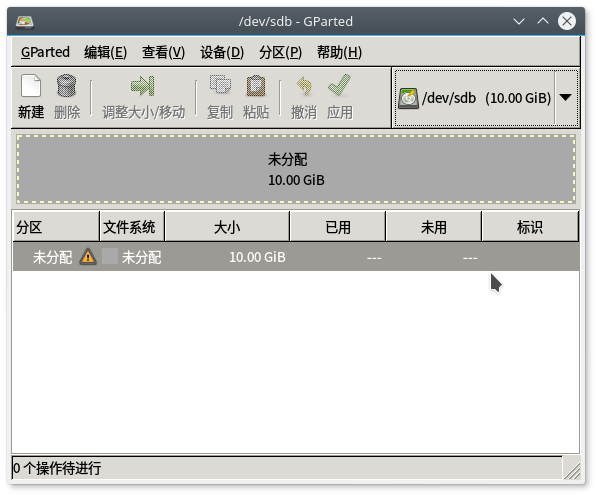
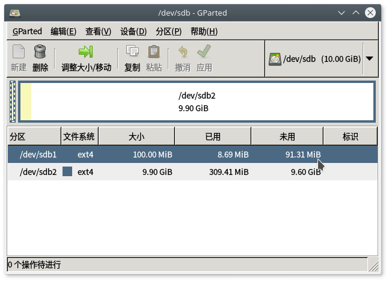
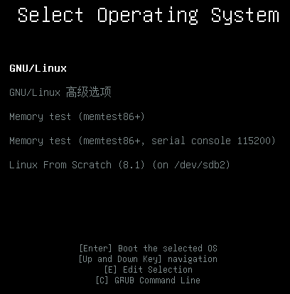
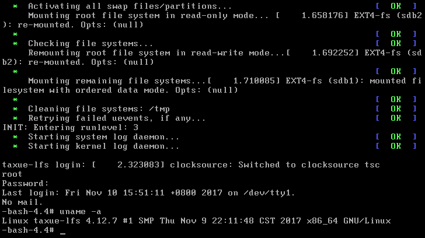

### Linux From Scratch(8.1)
#### 一、准备宿主系统
##### 1. 宿主系统情况
- 发行版：KDE neon 5.11
- 内核版本：4.10.0-37
- 虚拟化平台：VMware Workstation 14.0
##### 2. 宿主系统需求
- 需要的软件包(参照LFS8.1手册)
    - Bash-3.2 (/bin/sh should be a symbolic or hard link to bash)
    - Binutils-2.17 (Versions greater than 2.29 are not recommended as they have not been tested)
    - Bison-2.3 (/usr/bin/yacc should be a link to bison or small script that executes bison)
    - Bzip2-1.0.4
    - Coreutils-6.9
    - Diffutils-2.8.1
    - Findutils-4.2.31
    - Gawk-4.0.1 (/usr/bin/awk should be a link to gawk)
    - GCC-4.7 including the C++ compiler, g++ (Versions greater than 7.2.0 are not recommended as they have not been tested)
    - Glibc-2.11 (Versions greater than 2.26 are not recommended as they have not been tested)
    - Grep-2.5.1a
    - Gzip-1.3.12
    - Linux Kernel-3.2
    - M4-1.4.10
    - Make-3.81
    - Patch-2.5.4
    - Perl-5.8.8
    - Sed-4.1.5
    - Tar-1.22
    - Texinfo-4.7
    - Xz-5.0.0
- 安装缺失的包后可通过以下脚本查看各需要的软件是否符合要求
    `version-check.sh`（脚本来自LFS8.1手册）
    ``` bash
    #!/bin/bash
    # Simple script to list version numbers of critical development tools
    export LC_ALL=C
    bash --version | head -n1 | cut -d" " -f2-4
    MYSH=$(readlink -f /bin/sh)
    echo "/bin/sh -> $MYSH"
    echo $MYSH | grep -q bash || echo "ERROR: /bin/sh does not point to bash"
    unset MYSH

    echo -n "Binutils: "; ld --version | head -n1 | cut -d" " -f3-
    bison --version | head -n1

    if [ -h /usr/bin/yacc ]; then
        echo "/usr/bin/yacc -> `readlink -f /usr/bin/yacc`";
    elif [ -x /usr/bin/yacc ]; then
        echo yacc is `/usr/bin/yacc --version | head -n1`
    else
        echo "yacc not found"
    fi

    bzip2 --version 2>&1 < /dev/null | head -n1 | cut -d" " -f1,6-
    echo -n "Coreutils: "; chown --version | head -n1 | cut -d")" -f2
    diff --version | head -n1
    find --version | head -n1
    gawk --version | head -n1

    if [ -h /usr/bin/awk ]; then
        echo "/usr/bin/awk -> `readlink -f /usr/bin/awk`";
    elif [ -x /usr/bin/awk ]; then
        echo awk is `/usr/bin/awk --version | head -n1`
    else
        echo "awk not found"
    fi
    gcc --version | head -n1
    g++ --version | head -n1
    ldd --version | head -n1 | cut -d" " -f2- # glibc version
    grep --version | head -n1
    gzip --version | head -n1
    cat /proc/version
    m4 --version | head -n1
    make --version | head -n1
    patch --version | head -n1
    echo Perl `perl -V:version`
    sed --version | head -n1
    tar --version | head -n1
    makeinfo --version | head -n1
    xz --version | head -n1

    echo 'int main(){}' > dummy.c && g++ -o dummy dummy.c
    if [ -x dummy ]
        then echo "g++ compilation OK";
        else echo "g++ compilation failed"; fi
    rm -f dummy.c dummy
    ```
- 终端输出结果
    ```bash
    taxue@taxue-neon:~$ sh ./version-check.sh
    bash, version 4.3.48(1)-release
    /bin/sh -> /bin/dash
    ERROR: /bin/sh does not point to bash
    Binutils: (GNU Binutils for Ubuntu) 2.26.1
    bison (GNU Bison) 3.0.4
    /usr/bin/yacc -> /usr/bin/bison.yacc
    bzip2,  Version 1.0.6, 6-Sept-2010.
    Coreutils:  8.25
    diff (GNU diffutils) 3.3
    find (GNU findutils) 4.7.0-git
    GNU Awk 4.1.3, API: 1.1 (GNU MPFR 3.1.4, GNU MP 6.1.0)
    /usr/bin/awk -> /usr/bin/gawk
    gcc (Ubuntu 5.4.0-6ubuntu1~16.04.5) 5.4.0 20160609
    g++ (Ubuntu 5.4.0-6ubuntu1~16.04.5) 5.4.0 20160609
    (Ubuntu GLIBC 2.23-0ubuntu9) 2.23
    grep (GNU grep) 2.25
    gzip 1.6
    Linux version 4.10.0-37-generic (buildd@lgw01-amd64-037) (gcc version 5.4.0 20160609 (Ubuntu 5.4.0-6ubuntu1~16.04.4) ) #41~16.04.1-Ubuntu SMP Fri Oct 6 22:42:59 UTC 2017
    m4 (GNU M4) 1.4.17
    GNU Make 4.1
    GNU patch 2.7.5
    Perl version='5.22.1';
    sed (GNU sed) 4.2.2
    tar (GNU tar) 1.28
    texi2any (GNU texinfo) 6.1
    xz (XZ Utils) 5.1.0alpha
    g++ compilation OK
    ```
- 输出结果分析
    可以看到，除了`/bin/sh`默认指向的是`/bin/dash`之外，别的均满足要求，手动修改，基于Ubuntu的发行版执行以下指令`sudo dpkg-reconfigure dash`，选“否”即可，查看是否修改成功
    ``` bash
    taxue@taxue-neon:~$ ls -l /bin/sh
    lrwxrwxrwx 1 root root 4 11月  3 11:28 /bin/sh -> bash
    ```
##### 3. 创建新分区
- 在虚拟机中添加一块10G大小的新硬盘，在`Gparted`中可以查看到，设备为`/dev/sdb`
    
- 添加两个分区，文件系统均为ext4，一个100M，留作`/boot`，剩余空间留作`/`
    
##### 4. 设置$LFS变量
- 添加`LFS`变量，在`/etc/profile`中添加一行`export LFS=/mnt/lfs`，执行`source /etc/profile`使变量生效
- 测试是否设置正确
    ``` bash
    taxue@taxue-neon:~$ echo $LFS
    /mnt/lfs
    ```
##### 5. 挂载新分区
- 创建挂载点`/`并挂载文件系统
    ``` bash
    taxue@taxue-neon:~$ sudo mkdir -pv $LFS
    mkdir: 已创建目录 '/mnt/lfs'
    taxue@taxue-neon:~$ sudo mount -v -t ext4 /dev/sdb2 $LFS
    mount: /dev/sdb2 mounted on /mnt/lfs.
    ```
- 创建挂载点`/boot`并挂载文件系统
    ``` bash
    taxue@taxue-neon:~$ sudo mkdir -v $LFS/boot
    mkdir: 已创建目录 '/mnt/lfs/boot'
    taxue@taxue-neon:/mnt/lfs$ sudo mount -v -t ext4 /dev/sdb1 $LFS/boot
    mount: /dev/sdb1 mounted on /mnt/lfs/boot.
    ```
- 检测是否有误
    ``` bash
    taxue@taxue-neon:/mnt/lfs$ df -h | grep '/dev/sdb'
    /dev/sdb2       9.7G   23M  9.1G    1% /mnt/lfs
    /dev/sdb1        93M  1.6M   85M    2% /mnt/lfs/boot
    ```
    一切正常

#### 二、软件包和补丁
##### 1. 创建目录以供保存下载的软件包，目录以及解压出的源码
- 创建目录并添加权限
    ``` bash
    taxue@taxue-neon:/mnt/lfs$ sudo mkdir -v $LFS/sources
    mkdir: 已创建目录 '/mnt/lfs/sources'
    taxue@taxue-neon:/mnt/lfs$ sudo chmod a+wt $LFS/sources
    ```
- 下载需要的软件包和补丁，一共75个文件，将下列地址保存为文本文件，用wget批量下载
    ```
    http://download.savannah.gnu.org/releases/acl/acl-2.2.52.src.tar.gz
    http://download.savannah.gnu.org/releases/attr/attr-2.4.47.src.tar.gz
    http://ftp.gnu.org/gnu/autoconf/autoconf-2.69.tar.xz
    http://ftp.gnu.org/gnu/automake/automake-1.15.1.tar.xz
    http://ftp.gnu.org/gnu/bash/bash-4.4.tar.gz
    http://ftp.gnu.org/gnu/bc/bc-1.07.1.tar.gz
    http://ftp.gnu.org/gnu/binutils/binutils-2.29.tar.bz2
    http://ftp.gnu.org/gnu/bison/bison-3.0.4.tar.xz
    http://www.bzip.org/1.0.6/bzip2-1.0.6.tar.gz
    https://github.com/libcheck/check/releases/download/0.11.0/check-0.11.0.tar.gz
    http://ftp.gnu.org/gnu/coreutils/coreutils-8.27.tar.xz
    http://ftp.gnu.org/gnu/dejagnu/dejagnu-1.6.tar.gz
    http://ftp.gnu.org/gnu/diffutils/diffutils-3.6.tar.xz
    http://dev.gentoo.org/~blueness/eudev/eudev-3.2.2.tar.gz
    http://downloads.sourceforge.net/project/e2fsprogs/e2fsprogs/v1.43.5/e2fsprogs-1.43.5.tar.gz
    http://prdownloads.sourceforge.net/expat/expat-2.2.3.tar.bz2
    http://prdownloads.sourceforge.net/expect/expect5.45.tar.gz
    ftp://ftp.astron.com/pub/file/file-5.31.tar.gz
    http://ftp.gnu.org/gnu/findutils/findutils-4.6.0.tar.gz
    https://github.com/westes/flex/releases/download/v2.6.4/flex-2.6.4.tar.gz
    http://ftp.gnu.org/gnu/gawk/gawk-4.1.4.tar.xz
    http://ftp.gnu.org/gnu/gcc/gcc-7.2.0/gcc-7.2.0.tar.xz
    http://ftp.gnu.org/gnu/gdbm/gdbm-1.13.tar.gz
    http://ftp.gnu.org/gnu/gettext/gettext-0.19.8.1.tar.xz
    http://ftp.gnu.org/gnu/glibc/glibc-2.26.tar.xz
    http://ftp.gnu.org/gnu/gmp/gmp-6.1.2.tar.xz
    http://ftp.gnu.org/gnu/gperf/gperf-3.1.tar.gz
    http://ftp.gnu.org/gnu/grep/grep-3.1.tar.xz
    http://ftp.gnu.org/gnu/groff/groff-1.22.3.tar.gz
    http://ftp.gnu.org/gnu/grub/grub-2.02.tar.xz
    http://ftp.gnu.org/gnu/gzip/gzip-1.8.tar.xz
    http://anduin.linuxfromscratch.org/LFS/iana-etc-2.30.tar.bz2
    http://ftp.gnu.org/gnu/inetutils/inetutils-1.9.4.tar.xz
    http://launchpad.net/intltool/trunk/0.51.0/+download/intltool-0.51.0.tar.gz
    https://www.kernel.org/pub/linux/utils/net/iproute2/iproute2-4.12.0.tar.xz
    https://www.kernel.org/pub/linux/utils/kbd/kbd-2.0.4.tar.xz
    https://www.kernel.org/pub/linux/utils/kernel/kmod/kmod-24.tar.xz
    http://www.greenwoodsoftware.com/less/less-487.tar.gz
    http://www.linuxfromscratch.org/lfs/downloads/8.1/lfs-bootscripts-20170626.tar.bz2
    https://www.kernel.org/pub/linux/libs/security/linux-privs/libcap2/libcap-2.25.tar.xz
    http://download.savannah.gnu.org/releases/libpipeline/libpipeline-1.4.2.tar.gz
    http://ftp.gnu.org/gnu/libtool/libtool-2.4.6.tar.xz
    https://www.kernel.org/pub/linux/kernel/v4.x/linux-4.12.7.tar.xz
    http://ftp.gnu.org/gnu/m4/m4-1.4.18.tar.xz
    http://ftp.gnu.org/gnu/make/make-4.2.1.tar.bz2
    http://download.savannah.gnu.org/releases/man-db/man-db-2.7.6.1.tar.xz
    https://www.kernel.org/pub/linux/docs/man-pages/man-pages-4.12.tar.xz
    http://www.multiprecision.org/mpc/download/mpc-1.0.3.tar.gz
    http://www.mpfr.org/mpfr-3.1.5/mpfr-3.1.5.tar.xz
    http://ftp.gnu.org/gnu//ncurses/ncurses-6.0.tar.gz
    http://ftp.gnu.org/gnu/patch/patch-2.7.5.tar.xz
    http://www.cpan.org/src/5.0/perl-5.26.0.tar.xz
    https://pkg-config.freedesktop.org/releases/pkg-config-0.29.2.tar.gz
    http://sourceforge.net/projects/procps-ng/files/Production/procps-ng-3.3.12.tar.xz
    https://sourceforge.net/projects/psmisc/files/psmisc/psmisc-23.1.tar.xz
    http://ftp.gnu.org/gnu/readline/readline-7.0.tar.gz
    http://ftp.gnu.org/gnu/sed/sed-4.4.tar.xz
    https://github.com/shadow-maint/shadow/releases/download/4.5/shadow-4.5.tar.xz
    http://www.infodrom.org/projects/sysklogd/download/sysklogd-1.5.1.tar.gz
    http://download.savannah.gnu.org/releases/sysvinit/sysvinit-2.88dsf.tar.bz2
    http://ftp.gnu.org/gnu/tar/tar-1.29.tar.xz
    http://sourceforge.net/projects/tcl/files/Tcl/8.6.7/tcl-core8.6.7-src.tar.gz
    http://ftp.gnu.org/gnu/texinfo/texinfo-6.4.tar.xz
    http://www.iana.org/time-zones/repository/releases/tzdata2017b.tar.gz
    http://anduin.linuxfromscratch.org/LFS/udev-lfs-20140408.tar.bz2
    https://www.kernel.org/pub/linux/utils/util-linux/v2.30/util-linux-2.30.1.tar.xz
    ftp://ftp.vim.org/pub/vim/unix/vim-8.0.586.tar.bz2
    http://cpan.metacpan.org/authors/id/T/TO/TODDR/XML-Parser-2.44.tar.gz
    http://tukaani.org/xz/xz-5.2.3.tar.xz
    http://zlib.net/zlib-1.2.11.tar.xz
    http://www.linuxfromscratch.org/patches/lfs/8.1/bash-4.4-upstream_fixes-1.patch
    http://www.linuxfromscratch.org/patches/lfs/8.1/bzip2-1.0.6-install_docs-1.patch
    http://www.linuxfromscratch.org/patches/lfs/8.1/coreutils-8.27-i18n-1.patch
    http://www.linuxfromscratch.org/patches/lfs/8.1/glibc-2.26-fhs-1.patch
    http://www.linuxfromscratch.org/patches/lfs/8.1/kbd-2.0.4-backspace-1.patch
    http://www.linuxfromscratch.org/patches/lfs/8.1/sysvinit-2.88dsf-consolidated-1.patch
    ```

#### 三、最后的准备工作
##### 1. 创建 $LFS/tools 文件夹并建立链接
里面存放编译的临时工具，以确保与后面编译的需要正式用到的软件相分离
``` bash
root@taxue-neon:/mnt/lfs# mkdir -v $LFS/tools
mkdir: 已创建目录 '/mnt/lfs/tools'
root@taxue-neon:/mnt/lfs# ln -sv $LFS/tools /
'/tools' -> '/mnt/lfs/tools'
```
##### 2. 添加LFS用户
避免使用root用户操作时不当的错误破坏系统，建立一个新用户
- 建立用户
    ``` bash
    root@taxue-neon:/mnt/lfs# groupadd lfs
    root@taxue-neon:/mnt/lfs# useradd -s /bin/bash -g lfs -m -k /dev/null lfs
    ```
- 设置密码
    `passwd lfs`
- 文件目录权限
    ``` bash
    root@taxue-neon:/mnt/lfs# chown -v lfs $LFS/tools
    changed ownership of '/mnt/lfs/tools' from root to lfs
    root@taxue-neon:/mnt/lfs# chown -v lfs $LFS/sources
    changed ownership of '/mnt/lfs/sources' from root to lfs
    ```
- 切换用户
    `su - lfs`
##### 3. 设置环境
- 在lfs用户目录下创建一个新的`.bash_profile`文件，内容如下：
    ```bash
    exec env -i HOME=$HOME TERM=$TERM PS1='\u:\w\$ ' /bin/bash
    ```
    命令用除了HOME，TERM和PS1变量之外环境完全为空的shell代替运行中的shell，确保不会有意想不到的环境变量随宿主机流入构建的环境
- 在用户目录下创建`.bashrc`，该文件为上面新的shell实例（non-login）所读取，内容如下：
    ```bash
    set +h
    umask 022
    LFS=/mnt/lfs
    LC_ALL=POSIX
    LFS_TGT=$(uname -m)-lfs-linux-gnu
    PATH=/tools/bin:/bin:/usr/bin
    export LFS LC_ALL LFS_TGT PATH
    ```
    具体作用参见手册，此处不再赘述
- 启用配置
    `source ~/.bash_profile`
#### 4. 一些注意事项
- 并行编译可以减少编译时间，比如`make -j2`可以调用两个处理器同时编译，但为了在编译失败时正确分析错误日志，建议此时返回单处理器构建
- 测试套件能保证功能编译正确，但不建议在接下来的临时系统中执行测试套件，宿主机会对测试产生影响，造成一些奇怪的错误信息

#### 四、构建临时系统
##### 1. 说明
- 构建一个最小的Linux系统使其包含构建最终LFS系统所需的工具。第一步是构建一个宿主系统无关的新工具链，第二步是使用该工具链构建其他的基础工具。本章节编译的软件包被安装在`$LFS/tools`中以防止污染后面制作的LFS系统
- 编译前确保以下四项：
    - 使用的shell是bash
    - sh是到bash的符号链接
    - /usr/bin/awk是到gawk的符号链接
    - /usr/bin/yacc是到bison的符号链接或者一个启动bison的小脚本
- 编译完成后如无特殊说明删除解压后的源码文件夹
##### 2. Binutils-2.29-Pass1
- 文档建议在单独的build目录中编译
    ``` bash
    lfs@taxue-neon:/mnt/lfs/sources$ mkdir -v build
    mkdir: created directory 'build'
    lfs@taxue-neon:/mnt/lfs/sources$ cd build
    ```
- configure
    ``` bash
    lfs@taxue-neon:/mnt/lfs/sources/build$ ../binutils-2.29/configure --prefix=/tools    \
    > --with-sysroot=$LFS        \
    > --with-lib-path=/tools/lib \
    > --target=$LFS_TGT          \
    > --disable-nls              \
    > --disable-werror
    ```
- make
- 在x86_64上编译，创建符号链接以确保工具链的完整性
    ``` bash
    lfs@taxue-neon:/mnt/lfs/sources/build$ case $(uname -m) in
    > x86_64) mkdir -v /tools/lib && ln -sv lib /tools/lib64 ;;
    > esac
    mkdir: created directory '/tools/lib'
    '/tools/lib64' -> 'lib'
    ```
- make install
##### 3. GCC-7.2.0-Pass1
- GCC现在需要GMP，MPFR和MPC这几个包，将这些包解压到GCC源码目录并且重命名使得GCC编译过程自动使用它们
    ``` bash
    lfs@taxue-neon:/mnt/lfs/sources$ tar -xf gcc-7.2.0.tar.xz
    lfs@taxue-neon:/mnt/lfs/sources$ cd gcc-7.2.0
    lfs@taxue-neon:/mnt/lfs/sources/gcc-7.2.0$ tar -xf ../mpfr-3.1.5.tar.xz
    lfs@taxue-neon:/mnt/lfs/sources/gcc-7.2.0$ mv -v mpfr-3.1.5/ mpfr
    'mpfr-3.1.5/' -> 'mpfr'
    lfs@taxue-neon:/mnt/lfs/sources/gcc-7.2.0$ tar -xf ../gmp-6.1.2.tar.xz
    lfs@taxue-neon:/mnt/lfs/sources/gcc-7.2.0$ mv -v gmp-6.1.2/ gmp
    'gmp-6.1.2/' -> 'gmp'
    lfs@taxue-neon:/mnt/lfs/sources/gcc-7.2.0$ tar -xf ../mpc-1.0.3.tar.gz
    lfs@taxue-neon:/mnt/lfs/sources/gcc-7.2.0$ mv -v mpc-1.0.3/ mpc
    'mpc-1.0.3/' -> 'mpc'
    ```
- 执行下列指令修改GCC默认的动态链接器为安装在/tools中的，并从GCC的include搜索路径中移除/usr/include
    ``` bash
    lfs@taxue-neon:/mnt/lfs/sources/gcc-7.2.0$ for file in gcc/config/{linux,i386/linux{,64}}.h
    > do
    >   cp -uv $file{,.orig}
    >   sed -e 's@/lib\(64\)\?\(32\)\?/ld@/tools&@g' \
    >       -e 's@/usr@/tools@g' $file.orig > $file
    >   echo '
    > #undef STANDARD_STARTFILE_PREFIX_1
    > #undef STANDARD_STARTFILE_PREFIX_2
    > #define STANDARD_STARTFILE_PREFIX_1 "/tools/lib/"
    > #define STANDARD_STARTFILE_PREFIX_2 ""' >> $file
    >   touch $file.orig
    > done
    'gcc/config/linux.h' -> 'gcc/config/linux.h.orig'
    'gcc/config/i386/linux.h' -> 'gcc/config/i386/linux.h.orig'
    'gcc/config/i386/linux64.h' -> 'gcc/config/i386/linux64.h.orig'
    ```
- 在x86_64的主机上，为64位的库设置默认目录名至"lib"
    ``` bash
    lfs@taxue-neon:/mnt/lfs/sources/gcc-7.2.0$ case $(uname -m) in
    > x86_64)
    >   sed -e '/m64=/s/lib64/lib/'    \
    >       -i.orig gcc/config/i386/t-linux64
    > ;;
    > esac
    ```
- 新建一个build文件夹，configure
    ```bash
    lfs@taxue-neon:/mnt/lfs/sources/gcc-7.2.0/build$ ../configure    \            
    > --target=$LFS_TGT                    \
    > --prefix=/tools                      \
    > --with-glibc-version=2.11            \
    > --with-sysroot=$LFS                  \
    > --with-newlib                        \
    > --without-headers                    \
    > --with-local-prefix=/tools           \
    > --with-native-system-header-dir=/tools/include    \
    > --disable-nls                        \
    > --disable-shared                     \
    > --disable-multilib                   \
    > --disable-decimal-float              \
    > --disable-threads                    \
    > --disable-libatomic                  \
    > --disable-libgomp                    \
    > --disable-libmpx                     \
    > --disable-libquadmath                \
    > --disable-libssp                     \
    > --disable-libvtv                     \
    > --disable-libstdcxx                  \
    > --enable-languages=c,c++
    ```
- make, make install
##### 4. Linux-4.12.7 API头文件
- 确认没有陈旧的文件且不依赖于之前的操作
    ``` bash
    lfs@taxue-neon:/mnt/lfs/sources/linux-4.12.7$ make mrproper
    ```
- 从源码中提取用户可见的内核头文件，把它们保存在一个临时本地文件夹中然后复制到所需的位置
    依次执行`make INSTALL_HDR_PATH=dest headers_install`,`cp -rv dest/include/* /tools/include`
##### 5. Glibc-2.26
- 创建build目录并configure
    ``` bash
    lfs@taxue-neon:/mnt/lfs/sources/glibc-2.26$ mkdir -v build
    mkdir: created directory 'build'
    lfs@taxue-neon:/mnt/lfs/sources/glibc-2.26$ cd build/
    lfs@taxue-neon:/mnt/lfs/sources/glibc-2.26/build$ ../configure    \       
    > --prefix=/tools                          \
    > --host=$LFS_TGT                          \
    > --build=$(../scripts/config.guess)       \
    > --enable-kernel=3.2                      \
    > --with-headers=/tools/include            \
    > libc_cv_forced_unwind=yes                \
    > libc_cv_c_cleanup=yes
    ```
- make, make install
- 检查功能是否正常工作
    ``` bash
    lfs@taxue-neon:/mnt/lfs/sources/glibc-2.26/build$ echo 'int main(){}' > dummy.c
    lfs@taxue-neon:/mnt/lfs/sources/glibc-2.26/build$ $LFS_TGT-gcc dummy.c
    lfs@taxue-neon:/mnt/lfs/sources/glibc-2.26/build$ readelf -l a.out | grep ': /tools'
          [Requesting program interpreter: /tools/lib64/ld-linux-x86-64.so.2]
    ```
    如果一切工作正常，执行没有错误，并且最后一条命令有上述输出结果
- 清理测试文件
    `rm -v dunmy.c a.out`
##### 6. Libstdc++-7.2.0
- libstdc++是gcc源文件的一部分，需要先解压gcc源码并切换到目录下
- 创建build目录并configure
    ``` bash
    lfs@taxue-neon:/mnt/lfs/sources/gcc-7.2.0$ mkdir -v build
    mkdir: created directory 'build'
    lfs@taxue-neon:/mnt/lfs/sources/gcc-7.2.0$ cd build/
    lfs@taxue-neon:/mnt/lfs/sources/gcc-7.2.0/build$ ../libstdc++-v3/configure    \
    > --host=$LFS_TGT                    \      
    > --prefix=/tools                    \
    > --disable-multilib                 \
    > --disable-nls                      \
    > --disable-libstdcxx-threads        \
    > --disable-libstdcxx-pch            \
    > --with-gxx-include-dir=/tools/$LFS_TGT/include/c++/7.2.0
    ```
- make, make install
##### 7. Binutils-2.29-Pass2
- 创建build目录并configure
    ``` bash
    lfs@taxue-neon:/mnt/lfs/sources/binutils-2.29$ mkdir -v build
    mkdir: created directory 'build'
    lfs@taxue-neon:/mnt/lfs/sources/binutils-2.29$ cd build                     
    lfs@taxue-neon:/mnt/lfs/sources/binutils-2.29/build$ CC=$LFS_TGT-gcc    \                                
    > AR=$LFS_TGT-ar                         \
    > RANLIB=$LFS_TGT-ranlib                 \
    > ../configure                           \
    > --prefix=/tools                        \
    > --disable-nls                          \
    > --disable-werror                       \
    > --with-lib-path=/tools/lib             \
    > --with-sysroot
    ```
- make, make install
- 为下一章的“Re-adjusting”准备链接器
    ``` bash
    make -C ld clean
    make -C ld LIB_PATH=/usr/lib:/lib
    cp -v ld/ld-new /tools/bin
    ```
##### 8. GCC-7.2.0-Pass2
- 创建一个完整版本的内部头文件，并再一次更改GCC的默认动态链接器的位置，使用安装在/tools的那个
    ``` bash
    lfs@taxue-neon:/mnt/lfs/sources/gcc-7.2.0$ cat gcc/limitx.h gcc/glimits.h gcc/limity.h > \
    > `dirname $($LFS_TGT-gcc -print-libgcc-file-name)`/include-fixed/limits.h
    lfs@taxue-neon:/mnt/lfs/sources/gcc-7.2.0$ for file in gcc/config/{linux,i386/linux{,64}}.h
    > do
    >   cp -uv $file{,.orig}
    >   sed -e 's@/lib\(64\)\?\(32\)\?/ld@/tools&@g' \
    >       -e 's@/usr@/tools@g' $file.orig > $file
    >   echo '
    > #undef STANDARD_STARTFILE_PREFIX_1
    > #undef STANDARD_STARTFILE_PREFIX_2
    > #define STANDARD_STARTFILE_PREFIX_1 "/tools/lib/"
    > #define STANDARD_STARTFILE_PREFIX_2 ""' >> $file
    >   touch $file.orig
    > done
    'gcc/config/linux.h' -> 'gcc/config/linux.h.orig'
    'gcc/config/i386/linux.h' -> 'gcc/config/i386/linux.h.orig'
    'gcc/config/i386/linux64.h' -> 'gcc/config/i386/linux64.h.orig'
    ```
- 在x86_64环境上构建，为64位库改变默认目录名至"lib"
    ``` bash
    lfs@taxue-neon:/mnt/lfs/sources/gcc-7.2.0$ case $(uname -m) in
    > x86_64)
    >   sed -e '/m64=/s/lib64/lib/' \
    >       -i.orig gcc/config/i386/t-linux64
    > ;;
    > esac
    ```
- 和前一次一样，需要GMP、MPFR和MPC，解压并重命名
    ``` bash
    lfs@taxue-neon:/mnt/lfs/sources/gcc-7.2.0$ tar -xf ../mpfr-3.1.5.tar.xz
    lfs@taxue-neon:/mnt/lfs/sources/gcc-7.2.0$ mv -v mpfr-3.1.5 mpfr
    'mpfr-3.1.5' -> 'mpfr'
    lfs@taxue-neon:/mnt/lfs/sources/gcc-7.2.0$ tar -xf ../gmp-6.1.2.tar.xz
    lfs@taxue-neon:/mnt/lfs/sources/gcc-7.2.0$ mv -v gmp-6.1.2 gmp
    'gmp-6.1.2' -> 'gmp'
    lfs@taxue-neon:/mnt/lfs/sources/gcc-7.2.0$ tar -xf ../mpc-1.0.3.tar.gz
    lfs@taxue-neon:/mnt/lfs/sources/gcc-7.2.0$ mv -v mpc-1.0.3 mpc
    'mpc-1.0.3' -> 'mpc'
    ```
- 创建独立编译文件夹并configure
    ``` bash
    lfs@taxue-neon:/mnt/lfs/sources/gcc-7.2.0$ mkdir -v build
    mkdir: created directory 'build'
    lfs@taxue-neon:/mnt/lfs/sources/gcc-7.2.0$ cd build
    lfs@taxue-neon:/mnt/lfs/sources/gcc-7.2.0/build$ CC=$LFS_TGT-gcc    \
    > CXX=$LFS_TGT-g++                               \
    > AR=$LFS_TGT-ar                                 \
    > RANLIB=$LFS_TGT-ranlib                         \
    > ../configure                                   \
    > --prefix=/tools                                \
    > --with-local-prefix=/tools                     \
    > --with-native-system-header-dir=/tools/include \
    > --enable-languages=c,c++                       \
    > --disable-libstdcxx-pch                        \
    > --disable-multilib                             \
    > --disable-bootstrap                            \
    > --disable-libgomp
    ```
- make，make install
- 创建符号链接，保证cc能正常执行
    ``` bash
    lfs@taxue-neon:/mnt/lfs/sources/gcc-7.2.0/build$ ln -sv gcc /tools/bin/cc
    '/tools/bin/cc' -> 'gcc'
    ```
- 确认新工具链基本功能正常工作
    ``` bash
    lfs@taxue-neon:/mnt/lfs/sources/gcc-7.2.0/build$ echo 'int main(){}' > dummy.c
    lfs@taxue-neon:/mnt/lfs/sources/gcc-7.2.0/build$ cc dummy.c
    lfs@taxue-neon:/mnt/lfs/sources/gcc-7.2.0/build$ readelf -l a.out | grep ': /tools'
        [Requesting program interpreter: /tools/lib64/ld-linux-x86-64.so.2]
    ```
    一切工作正常，这里没有错误并给出上述输出
##### 9. Tcl-core-8.6.7
- Tcl和Expect、、DejaGNU、Check是用来为GCC和Binutils以及其他软件包测试套件提供运行支持的
- configure
    ``` bash
    lfs@taxue-neon:/mnt/lfs/sources/tcl8.6.7$ cd unix
    lfs@taxue-neon:/mnt/lfs/sources/tcl8.6.7/unix$ ./configure --prefix=/tools
    ```
- make,make install
- 让安装的库文件可写，便于之后删除调试符号
    ``` bash
    lfs@taxue-neon:/mnt/lfs/sources/tcl8.6.7/unix$ chmod -v u+w /tools/lib/libtcl8.6.so
    mode of '/tools/lib/libtcl8.6.so' changed from 0555 (r-xr-xr-x) to 0755 (rwxr-xr-x)
    ```
- 安装头文件，创建软连接
    ``` bash
    lfs@taxue-neon:/mnt/lfs/sources/tcl8.6.7/unix$ make install-private-headers
    Installing private header files to /tools/include/
    lfs@taxue-neon:/mnt/lfs/sources/tcl8.6.7/unix$ ln -sv tclsh8.6 /tools/bin/tclsh
    '/tools/bin/tclsh' -> 'tclsh8.6'
    ```
##### 10. Expect-5.45
- 强制Expect的configure配置脚本使用/bin/stty替代宿主机系统里可能存在的/usr/local/bin/stty，确保套件最后一次构建正常
    ``` bash
    lfs@taxue-neon:/mnt/lfs/sources/expect5.45$ cp -v configure{,.orig}
    'configure' -> 'configure.orig'
    lfs@taxue-neon:/mnt/lfs/sources/expect5.45$ sed 's:/usr/local/bin:/bin:' configure.orig > configure
    ```
- configure
    ``` bash
    lfs@taxue-neon:/mnt/lfs/sources/expect5.45$ ./configure --prefix=/tools    \
    > --with-tcl=/tools/lib          \
    > --with-tclinclude=/tools/include
    ```
- 编译，安装
    - 编译执行make即可
    - 安装执行`make SCRIPTS="" install`
##### 11. DejaGNU-1.6
- configure
    ``` bash
    lfs@taxue-neon:/mnt/lfs/sources/dejagnu-1.6$ ./configure --prefix=/tools
    ```
- 编译安装
    `make install`
##### 11. Check-0.11.0
- configure
    ``` bash
    lfs@taxue-neon:/mnt/lfs/sources/check-0.11.0$ PKG_CONFIG= ./configure --prefix=/tools
    ```
- make, make install
##### 12. Ncurses-6.0
- 安装前，需确保gawk在第一次配置时已找到
    `sed -i s/mawk// configure`
- configure
    ``` bash
    lfs@taxue-neon:/mnt/lfs/sources/ncurses-6.0$ ./configure --prefix=/tools    \
    > --with-shared        \
    > --without-debug      \
    > --without-ada        \
    > --enable-widec       \
    > --enable-overwrite
    ```
- make, make install
##### 13. Bash-4.4
- configure
    ``` bash
    lfs@taxue-neon:/mnt/lfs/sources/bash-4.4$ ./configure --prefix=/tools --without-bash-malloc
    ```
- make, make install
- 为使用sh终端的程序创建一个软链接
    ``` bash
    lfs@taxue-neon:/mnt/lfs/sources/bash-4.4$ ln -sv bash /tools/bin/sh
    '/tools/bin/sh' -> 'bash'
    ```
##### 14. Bison-3.0.4
- configure
    ``` bash
    lfs@taxue-neon:/mnt/lfs/sources/bison-3.0.4$ ./configure --prefix=/tools
    ```
- make, make install
##### 15. Bzip2-1.0.6
- Bzip2不包含configure脚本，直接`make`
- 安装
    ```
    lfs@taxue-neon:/mnt/lfs/sources/bzip2-1.0.6$ make PREFIX=/tools install
    ```
##### 15. Coreutils-8.27
- configure
    ``` bash
    lfs@taxue-neon:/mnt/lfs/sources/coreutils-8.27$ ./configure --prefix=/tools --enable-install-program=hostname
    ```
- make, make install
##### 16. Diffutils-3.6
- configure
    ``` bash
    lfs@taxue-neon:/mnt/lfs/sources/diffutils-3.6$ ./configure --prefix=/tools
    ```
- make, make install
##### 17. File-5.31
- configure
    ``` bash
    lfs@taxue-neon:/mnt/lfs/sources/file-5.31$ ./configure --prefix=/tools
    ```
- make, make install
##### 18. Findutils-4.6.0
- configure
    ``` bash
    lfs@taxue-neon:/mnt/lfs/sources/findutils-4.6.0$ ./configure --prefix=/tools
    ```
- make, make install
##### 19. Gawk-4.1.4
- configure
    ``` bash
    lfs@taxue-neon:/mnt/lfs/sources/gawk-4.1.4$ ./configure --prefix=/tools
    ```
- make, make install
##### 20. Gettext-0.19.8.1
- configure，本次编译的临时工具集中只用到Gettext的三个程序
    ```
    lfs@taxue-neon:/mnt/lfs/sources/gettext-0.19.8.1$ cd gettext-tools/
    lfs@taxue-neon:/mnt/lfs/sources/gettext-0.19.8.1/gettext-tools$ EMACS="no" ./configure --prefix=/tools --disable-shared
    ```
- 编译软件包
    ``` bash
    make -C gnulib-lib
    make -C intl pluralx.c
    make -C src msgfmt
    make -C src msgmerge
    make -C src xgettext
    ```
- 安装
    ```
    lfs@taxue-neon:/mnt/lfs/sources/gettext-0.19.8.1/gettext-tools$ cp -v src/{msgfmt,msgmerge,xgettext} /tools/bin
    'src/msgfmt' -> '/tools/bin/msgfmt'
    'src/msgmerge' -> '/tools/bin/msgmerge'
    'src/xgettext' -> '/tools/bin/xgettext'
    ```
##### 21. Grep-3.1
- configure
    ``` bash
    lfs@taxue-neon:/mnt/lfs/sources/grep-3.1$ ./configure --prefix=/tools
    ```
- make, make install
##### 22. Gzip-1.8
- configure
    ``` bash
    lfs@taxue-neon:/mnt/lfs/sources/gzip-1.8$ ./configure --prefix=/tools
    ```
- make, make install
##### 23. M4-1.4.18
- configure
    ``` bash
    lfs@taxue-neon:/mnt/lfs/sources/m4-1.4.18$ ./configure --prefix=/tools
    ```
- make, make install
##### 24. Make-4.2.1
- configure
    ```
    lfs@taxue-neon:/mnt/lfs/sources/make-4.2.1$ ./configure --prefix=/tools --without-guile
    ```
- make, make install
##### 25. Patch-2.7.5
- configure
    ``` bash
    lfs@taxue-neon:/mnt/lfs/sources/patch-2.7.5$ ./configure --prefix=/tools
    ```
- make, make install
##### 26. Perl-5.26.0
- 首先修复一个只会在LFS环境中出现的编译问题
    ``` bash
    lfs@taxue-neon:/mnt/lfs/sources/perl-5.26.0$ sed -e '9751 a#ifndef PERL_IN_XSUB_RE' \
    > -e '9808 a#endif'    \
    > -i regexec.c
    ```
- 准备编译
    ``` bash
    lfs@taxue-neon:/mnt/lfs/sources/perl-5.26.0$ sh Configure -des -Dprefix=/tools -Dlibs=-lm
    ```
- make
- 这次只需要安装小部分工具和库
    ```
    cp -v perl cpan/podlators/scripts/pod2man /tools/bin
    mkdir -pv /tools/lib/perl5/5.26.0
    cp -Rv lib/* /tools/lib/perl5/5.26.0
    ```
##### 27. Sed-4.4
- configure
    ``` bash
    lfs@taxue-neon:/mnt/lfs/sources/sed-4.4$ ./configure --prefix=/tools
    ```
- make, make install
##### 28. Tar-1.29
- configure
    ``` bash
    lfs@taxue-neon:/mnt/lfs/sources/tar-1.29$ ./configure --prefix=/tools
    ```
##### 29. Texinfo-6.4
- configure
    ``` bash
    lfs@taxue-neon:/mnt/lfs/sources/texinfo-6.4$ ./configure --prefix=/tools
    ```
    **注意** 过程中会报一个跟TestXS_la-TestXS.lo有关的错误，这与LFS无关可以忽略
- make, make install
##### 30. Util-linux-2.30.1
- configure
    ``` bash
    lfs@taxue-neon:/mnt/lfs/sources/util-linux-2.30.1$ ./configure --prefix=/tools  \
    > --without-python                    \
    > --disable-makeinstall-chown         \
    > --without-systemdsystemunitdir      \
    > --without-ncurses                   \
    > PKG_CONFIG=""
    ```
- make, make install
##### 31. Xz-5.2.3
- configure
    ``` bash
    lfs@taxue-neon:/mnt/lfs/sources/xz-5.2.3$ ./configure --prefix=/tools
    ```
- make, make install
##### 32. 清理无用内容（可选）
- 清理一些不需要的调试符号
    ``` bash
    lfs@taxue-neon:/mnt/lfs/sources$ strip --strip-debug /tools/lib/*
    lfs@taxue-neon:/mnt/lfs/sources$ /usr/bin/strip --strip-unneeded /tools/{,s}bin/*
    ```
- 为了节省更多空间，删除帮助文档
    ``` bash
    lfs@taxue-neon:/mnt/lfs/sources$ rm -rf /tools/{,share}/{info,man,doc}
    ```
##### 33. 改变属主
- 后面的命令都必须以root身份执行而不再是lfs用户，再次确认下 \$LFS 在root环境下也有定义，通过下面的命令将 \$LFS/tools 目录的属主改为 root 用户
    ``` bash
    root@taxue-neon:/mnt/lfs# chown -R root:root $LFS/tools
    ```

#### 五、构建LFS系统
##### 1. 简介
- 本章中会chroot进入之前准备好的临时迷你Linux系统，做一些最后的准备工作，然后开始安装软件包
- 为避免增加编译难度以及运行时可能出现的问题，不建议在编译时使用优化
- 本章安装软件包顺序需要严格遵守，保证不会有程序意外依赖与/tools路径的硬链相关的目录，同样的理由，不要同时编译不同的软件包
- 本章的程序移出或禁止了大部分静态库的安装，只有少数如glibc和gcc使用的静态库在软件包的构建过程中是必不可少的
##### 2. 准备虚拟内核文件系统
- 内核会挂载几个文件系统用于自己和用户空间程序交换信息，这些文件系统是虚拟的，不占用实际磁盘空间，它们的内容会放在内存里
- 创建用来挂载文件系统的目录
    ``` bash
    root@taxue-neon:/mnt/lfs# mkdir -pv $LFS/{dev,proc,sys,run}
    mkdir: 已创建目录 '/mnt/lfs/dev'
    mkdir: 已创建目录 '/mnt/lfs/proc'
    mkdir: 已创建目录 '/mnt/lfs/sys'
    mkdir: 已创建目录 '/mnt/lfs/run'
    ```
- 创建初始设备节点
在内核引导系统的时候，它依赖于几个设备节点， 特别是 console 和 null 两个设备。设备点必须创建在硬盘上以保证在 udevd 启动前是可用的
    ``` bash
    root@taxue-neon:/mnt/lfs# mknod -m 600 $LFS/dev/console c 5 1
    root@taxue-neon:/mnt/lfs# mknod -m 666 $LFS/dev/null c 1 3
    ```
- 挂载和激活/dev
    ``` bash
    root@taxue-neon:/mnt/lfs# mount -v --bind /dev $LFS/dev
    mount: /dev bound on /mnt/lfs/dev.
    ```
- 挂载虚拟文件系统
    ``` bash
    root@taxue-neon:/mnt/lfs# mount -vt devpts devpts $LFS/dev/pts -o gid=5,mode=620
    mount: devpts mounted on /mnt/lfs/dev/pts.
    root@taxue-neon:/mnt/lfs# mount -vt proc proc $LFS/proc
    mount: proc mounted on /mnt/lfs/proc.
    root@taxue-neon:/mnt/lfs# mount -vt sysfs sysfs $LFS/sys
    mount: sysfs mounted on /mnt/lfs/sys.
    root@taxue-neon:/mnt/lfs# mount -vt tmpfs tmpfs $LFS/run
    mount: tmpfs mounted on /mnt/lfs/run.
    ```
    - 在某些宿主机系统里，/dev/shm 是一个指向 /run/shm 的软链接。这个 /run 下的 tmpfs 文件系统已经在之前挂载了，所以在这里只需要创建一个目录
    ``` bash
    root@taxue-neon:/mnt/lfs# if [ -h $LFS/dev/shm ]; then
    > mkdir -pv $LFS/$(readlink $LFS/dev/shm)
    > fi
    ```
##### 3. 进入Chroot环境
- 执行下列命令切换环境，具体作用详见手册
    ``` bash
    root@taxue-neon:/mnt/lfs# chroot "$LFS" /tools/bin/env -i  \
    > HOME=/root                                      \
    > TERM="$TERM"                                    \
    > PS1='\u:\w\$ '                                  \
    > PATH=/bin:/usr/bin:/sbin:/usr/sbin:/tools/bin   \
    > /tools/bin/bash --login +h
    ```
- 此时bash的提示符是这样的：`I have no name!:/#`，这是正常的，因为/etc/passwd文件还没有被创建
- **注意** ，本章开始后续的所有命令都要在chroot环境下运行，如果因为某种原因离开了这个环境，请确保按照“挂载和激活/dev”和“挂载虚拟文件系统”重新操作，在继续构建之前重新chroot进入幻境
##### 4. 创建目录
- 创建LFS文件系统的目录结构
    ``` bash
    mkdir -pv /{bin,boot,etc/{opt,sysconfig},home,lib/firmware,mnt,opt}
    mkdir -pv /{media/{floppy,cdrom},sbin,srv,var}
    install -dv -m 0750 /root
    install -dv -m 1777 /tmp /var/tmp
    mkdir -pv /usr/{,local/}{bin,include,lib,sbin,src}
    mkdir -pv /usr/{,local/}share/{color,dict,doc,info,locale,man}
    mkdir -v /usr/{,local/}share/{misc,terminfo,zoneinfo}
    mkdir -v /usr/libexec
    mkdir -pv /usr/{,local/}share/man/man{1..8}

    case $(uname -m) in
    x86_64) mkdir -v /lib64 ;;
    esac

    mkdir -v /var/{log,mail,spool}
    ln -sv /run /var/run
    ln -sv /run/lock /var/lock
    mkdir -pv /var/{opt,cache,lib/{color,misc,locate},local}
    ```
##### 5. 创建必要的文件和符号链接
- 有些程序里会使用写死的路径调用其它暂时还未安装的程序。为了满足这种类型程序的需要，我们将创建一
些符号链接，在完成本章内容后这些软件会安装好，并替代之前的符号链接
    ``` bash
    ln -sv /tools/bin/{bash,cat,dd,echo,ln,pwd,rm,stty} /bin
    ln -sv /tools/bin/{install,perl} /usr/bin
    ln -sv /tools/lib/libgcc_s.so{,.1} /usr/lib
    ln -sv /tools/lib/libstdc++.{a,so{,.6}} /usr/lib
    sed 's/tools/usr/' /tools/lib/libstdc++.la > /usr/lib/libstdc++.la
    ln -sv bash /bin/sh
    ```
- 由于历史原因，Linux 在文件 /etc/mtab 中维护一个已挂载文件系统的列表。而现代内核改为在内部维护这个列表，并通过 /proc 文件系统输出给用户。为了满足一些依赖 /etc/mtab 文件的应用程序，我们要
创建下面的符号链接
    ``` bash
    ln -sv /proc/self/mounts /etc/mtab
    ```
- 为了让 root 用户能正常登录，而且 “root” 的名字能被正常识别，必须在文件 /etc/passwd 和 /etc/group 中写入相应的内容
    - 创建/etc/passwd
    ``` bash
    I have no name!:/# cat > /etc/passwd << "EOF"
    > root:x:0:0:root:/root:/bin/bash
    > bin:x:1:1:bin:/dev/null:/bin/false
    > daemon:x:6:6:Daemon User:/dev/null:/bin/false
    > messagebus:x:18:18:D-Bus Message Daemon User:/var/run/dbus:/bin/false
    > nobody:x:99:99:Unprivileged User:/dev/null:/bin/false
    > EOF
    ```
    - 创建/etc/group
    ``` bash
    I have no name!:/# cat > /etc/group << "EOF"
    > root:x:0:
    > bin:x:1:daemon
    > sys:x:2:
    > kmem:x:3:
    > tape:x:4:
    > tty:x:5:
    > daemon:x:6:
    > floppy:x:7:
    > disk:x:8:
    > lp:x:9:
    > dialout:x:10:
    > audio:x:11:
    > video:x:12:
    > utmp:x:13:
    > usb:x:14:
    > cdrom:x:15:
    > adm:x:16:
    > messagebus:x:18:
    > systemd-journal:x:23:
    > input:x:24:
    > mail:x:34:
    > nogroup:x:99:
    > users:x:999:
    > EOF
    ```
- 为了移除 “I have no name!” 的提示符，可以打开一个新 shell。由于完整的 Glibc 已经在上一章里装好了，而且已经创建好了 /etc/passwd 和 /etc/group 文件，用户名和组名就可以正常解析了
    ``` bash
    I have no name!:/# exec /tools/bin/bash --login +h
    root:/#
    ```
- 初始化一下日志文件并加上合适的权限
    ``` bash
    touch /var/log/{btmp,lastlog,faillog,wtmp}
    chgrp -v utmp /var/log/lastlog
    chmod -v 664 /var/log/lastlog
    chmod -v 600 /var/log/btmp
    ```
##### 6. Linux-4.12.7 API Headers
- 确保在之前的动作里没有留下旧文件和依赖关系
    ``` bash
    root:/sources/linux-4.12.7# make mrproper
    ```
- 解压出需要的内核头文件，解压过程会删除目标目录下所有文件，所以我们会先输出到一个本地中间目录后再拷贝到需要的地方，把不需要的删除
    ``` bash
    make INSTALL_HDR_PATH=dest headers_install
    find dest/include \( -name .install -o -name ..install.cmd \) -delete
    cp -rv dest/include/* /usr/include
    ```
##### 7. Man-pages-4.12
- install
    ``` bash
    root:/sources/man-pages-4.12# make install
    ```
##### 8. Glibc-2.26
- 有些 Glibc 程序会用到和 FHS 不兼容的 /var/db 目录来存储它们的运行时数据。打上如下的补丁让这些程序在 FHS 兼容的位置存储它们的运行时数据
    ``` bash
    root:/sources/glibc-2.26# patch -Np1 -i ../glibc-2.26-fhs-1.patch
    ```
- 创建一个兼容性符号链接，以避免在最终的glibc中引用/tools
    ```
    root:/sources/glibc-2.26# ln -sfv /tools/lib/gcc /usr/lib
    '/usr/lib/gcc' -> '/tools/lib/gcc'
    ```
- 为了符合 LSB 规范创建一个软链接，x86_64 情况下，为了使动态加载器正确运作，再创建一个兼容性的软链接
    ```
    case $(uname -m) in
        i?86) GCC_INCDIR=/usr/lib/gcc/$(uname -m)-pc-linux-gnu/7.2.0/include
            ln -sfv ld-linux.so.2 /lib/ld-lsb.so.3
        ;;
        x86_64) GCC_INCDIR=/usr/lib/gcc/x86_64-pc-linux-gnu/7.2.0/include
            ln -sfv ../lib/ld-linux-x86-64.so.2 /lib64
            ln -sfv ../lib/ld-linux-x86-64.so.2 /lib64/ld-lsb-x86-64.so.3
        ;;
    esac
    ```
- 删除以前的构建尝试可能遗留的文件
    ``` bash
    root:/sources/glibc-2.26# rm -f /usr/include/limits.h
    ```
- 创建build文件夹并configure
    ```
    root:/sources/glibc-2.26# mkdir -v build
    mkdir: created directory 'build'
    root:/sources/glibc-2.26# cd build
    root:/sources/glibc-2.26/build# CC="gcc -isystem $GCC_INCDIR -isystem /usr/include"  \
    > ../configure --prefix=/usr          \
    > --disable-werror                    \
    > --enable-kernel=3.2                 \
    > --enable-stack-protector=strong     \
    > libc_cv_slibdir=/lib
    ......
    root:/sources/glibc-2.26/build# unset GCC_INCDIR
    ```
- make
- 推荐执行`make check`进行测试，有几项可能的失败具体可以参见手册
- 在安装 Glibc 时会抱怨找不到 /etc/ld.so.conf 文件，这只是无关紧要的输出信息。下面的方式可以避免这个警告
    `touch /etc/ld.so.conf`
- 修改生成的Makefile以跳过一个在LFS部分环境中会失败的不需要的检查
    `sed '/test-installation/s@$(PERL)@echo not running@' -i ../Makefile`
- make install
- 为nscd安装配置文件和运行目录
    ``` bash
    root:/sources/glibc-2.26/build# cp -v ../nscd/nscd.conf /etc/nscd.conf
    '../nscd/nscd.conf' -> '/etc/nscd.conf'
    root:/sources/glibc-2.26/build# mkdir -pv /var/cache/nscd
    mkdir: created directory '/var/cache/nscd'
    ```
- 安装可以使系统响应不同语言的地域设置，如果缺少其中的某些，可能会导致在未来的软件包测试套件中，跳过了重要的测试项目
    ``` bash
    mkdir -pv /usr/lib/locale
    localedef -i cs_CZ -f UTF-8 cs_CZ.UTF-8
    localedef -i de_DE -f ISO-8859-1 de_DE
    localedef -i de_DE@euro -f ISO-8859-15 de_DE@euro
    localedef -i de_DE -f UTF-8 de_DE.UTF-8
    localedef -i en_GB -f UTF-8 en_GB.UTF-8
    localedef -i en_HK -f ISO-8859-1 en_HK
    localedef -i en_PH -f ISO-8859-1 en_PH
    localedef -i en_US -f ISO-8859-1 en_US
    localedef -i en_US -f UTF-8 en_US.UTF-8
    localedef -i es_MX -f ISO-8859-1 es_MX
    localedef -i fa_IR -f UTF-8 fa_IR
    localedef -i fr_FR -f ISO-8859-1 fr_FR
    localedef -i fr_FR@euro -f ISO-8859-15 fr_FR@euro
    localedef -i fr_FR -f UTF-8 fr_FR.UTF-8
    localedef -i it_IT -f ISO-8859-1 it_IT
    localedef -i it_IT -f UTF-8 it_IT.UTF-8
    localedef -i ja_JP -f EUC-JP ja_JP
    localedef -i ru_RU -f KOI8-R ru_RU.KOI8-R
    localedef -i ru_RU -f UTF-8 ru_RU.UTF-8
    localedef -i tr_TR -f UTF-8 tr_TR.UTF-8
    localedef -i zh_CN -f GB18030 zh_CN.GB18030
    ```
- 配置Glibc
    - 添加nsswitch.conf，由于 Glibc 的默认状态在网络环境下工作的并不好，所以需要创建/etc/nsswitch.conf 文件
        ``` bash
        cat > /etc/nsswitch.conf << "EOF"
        # Begin /etc/nsswitch.conf
        passwd: files
        group: files
        shadow: files
        hosts: files dns
        networks: files
        protocols: files
        services: files
        ethers: files
        rpc: files
        # End /etc/nsswitch.conf
        EOF
        ```
    - 添加时区数据
        ``` bash
        tar -xf ../../tzdata2017b.tar.gz

        ZONEINFO=/usr/share/zoneinfo
        mkdir -pv $ZONEINFO/{posix,right}

        for tz in etcetera southamerica northamerica europe africa antarctica \
                asia australasia backward pacificnew systemv; do
            zic -L /dev/null -d $ZONEINFO -y "sh yearistype.sh" ${tz}
            zic -L /dev/null -d $ZONEINFO/posix -y "sh yearistype.sh" ${tz}
            zic -L leapseconds -d $ZONEINFO/right -y "sh yearistype.sh" ${tz}
        done

        cp -v zone.tab zone1970.tab iso3166.tab $ZONEINFO
        zic -d $ZONEINFO -p America/New_York
        unset ZONEINFO
        ```
        - 一种确定本地时区的方式是运行下面的脚本
            `tzselect`
        - 运行下面的命令创建 /etc/localtime 文件
            `cp -v /usr/share/zoneinfo/<xxx> /etc/localtime`
        将命令中的 <xxx> 替换成你所在实际时区的名字，比如Asia/Shanghai
    - 配置动态库加载器
        - /usr/local/lib 和 /opt/lib，把这两个目录加到动态库加载器的搜索路径中
            ``` bash
            cat > /etc/ld.so.conf << "EOF"
            # Begin /etc/ld.so.conf
            /usr/local/lib
            /opt/lib

            EOF
            ```
        - 如果需要的话，动态库加载器也可以查找目录并包含里面配置文件的内容。通常在这个包含目录下的文件只有一行字指向库目录。运行下面的命令增加这个功能
            ``` bash
            cat >> /etc/ld.so.conf << "EOF"
            # Add an include directory
            include /etc/ld.so.conf.d/*.conf
            EOF

            mkdir -pv /etc/ld.so.conf.d
            ```
##### 9. 调整工具链
- 现在最后的 C 语言库已经装好了，调整工具链，让新编译的程序链接到这些新的库上
- 首先,备份 /tools 链接器，然后用我们在上一章调整过的链接器代替它。我们还会创建一个链接，链接到 /tools/$(uname -m)-pc-linux-gnu/bin 的副本
    ``` bash
    mv -v /tools/bin/{ld,ld-old}
    mv -v /tools/$(uname -m)-pc-linux-gnu/bin/{ld,ld-old}
    mv -v /tools/bin/{ld-new,ld}
    ln -sv /tools/bin/ld /tools/$(uname -m)-pc-linux-gnu/bin/ld
    ```
- 接下来，修改 GCC 参数文件，让它指向新的动态连接器
    ``` bash
    gcc -dumpspecs | sed -e 's@/tools@@g' \
        -e '/\*startfile_prefix_spec:/{n;s@.*@/usr/lib/ @}' \
        -e '/\*cpp:/{n;s@$@ -isystem /usr/include@}' > \
        `dirname $(gcc --print-libgcc-file-name)`/specs
    ```
- 确保已调整的工具链的基本功能（编译和链接）都能如期进行
    ``` bash
    root:/sources# echo 'int main(){}' > dummy.c
    root:/sources# cc dummy.c -v -Wl,--verbose &> dummy.log
    root:/sources# readelf -l a.out | grep ': /lib'
          [Requesting program interpreter: /lib64/ld-linux-x86-64.so.2]
    ```
    正常情况下没有任何错误，并且最后给出上述输出
- 确保设置了正确的启动文件
    ``` bash
    root:/sources# grep -o '/usr/lib.*/crt[1in].*succeeded' dummy.log
    /usr/lib/../lib/crt1.o succeeded
    /usr/lib/../lib/crti.o succeeded
    /usr/lib/../lib/crtn.o succeeded
    ```
- 确保链接器能找到正确的头文件
    ``` bash
    root:/sources# grep -B1 '^ /usr/include' dummy.log
    #include <...> search starts here:
     /usr/include
    ```
    应返回上述输出
- 确认新的链接器已经在使用正确的搜索路径
    ``` bash
    root:/sources# grep 'SEARCH.*/usr/lib' dummy.log |sed 's|; |\n|g'
    SEARCH_DIR("=/tools/x86_64-pc-linux-gnu/lib64")
    SEARCH_DIR("/usr/lib")
    SEARCH_DIR("/lib")
    SEARCH_DIR("=/tools/x86_64-pc-linux-gnu/lib");
    ```
    有上述二、三条输出即可
- 确定使用的是正确的libc
    ``` bash
    root:/sources# grep "/lib.*/libc.so.6 " dummy.log
    attempt to open /lib/libc.so.6 succeeded
    ```
    有上述输出即可
- 确保GCC使用的是正确的动态链接器
    ``` bash
    root:/sources# grep found dummy.log
    found ld-linux-x86-64.so.2 at /lib/ld-linux-x86-64.so.2
    ```
    有上述输出结果即可
- 一切正常，清除测试文件
    `rm -v dummy.c a.out dummy.log`
##### 10. Zlib-1.2.11
- configure
    ``` bash
    root:/sources/zlib-1.2.11# ./configure --prefix=/usr
    ```
- make, make check, make install
- 共享库需要移动到 /lib，因此需要重建 .so 里面的 /usr/lib 文件
    ``` bash
    root:/sources/zlib-1.2.11# mv -v /usr/lib/libz.so.* /lib
    '/usr/lib/libz.so.1' -> '/lib/libz.so.1'
    '/usr/lib/libz.so.1.2.11' -> '/lib/libz.so.1.2.11'
    root:/sources/zlib-1.2.11# ln -sfv ../../lib/$(readlink /usr/lib/libz.so) /usr/lib/libz.so
    '/usr/lib/libz.so' -> '../../lib/libz.so.1.2.11'
    ```
##### 11. File-5.31
- configure
    ``` bash
    root:/sources/file-5.31# ./configure --prefix=/usr
    ```
- make, make check, make install
##### 12. Readline-7.0
- 重装 Readline 会使旧的库移动到 <libraryname>.old。通常来说这并不是什么问题，但一些情况下可能引起ldconfig 链接错误。可以通过下面的两个 sed 命令避免这个问题
    ``` bash
    root:/sources/readline-7.0# sed -i '/MV.*old/d' Makefile.in
    root:/sources/readline-7.0# sed -i '/{OLDSUFF}/c:' support/shlib-install
    ```
- configure
    ``` bash
    root:/sources/readline-7.0# ./configure --prefix=/usr  \
    > --disable-static                    \
    > --docdir=/usr/share/doc/readline-7.0
    ```
- 编译
    ``` bash
    make SHLIB_LIBS="-L/tools/lib -lncursesw"
    ```
- 安装
    ``` bash
    make SHLIB_LIBS="-L/tools/lib -lncurses" install
    ```
- 移动动态库到更合适的位置并修正一些符号链接
    ``` bash
    mv -v /usr/lib/lib{readline,history}.so.* /lib
    ln -sfv ../../lib/$(readlink /usr/lib/libreadline.so) /usr/lib/libreadline.so
    ln -sfv ../../lib/$(readlink /usr/lib/libhistory.so ) /usr/lib/libhistory.so
    ```
- 如果需要，安装帮助文档
    ``` bash
    install -v -m644 doc/*.{ps,pdf,html,dvi} /usr/share/doc/readline-7.0
    ```
##### 13. M4-1.4.18
- configure
    ``` bash
    root:/sources/m4-1.4.18# ./configure --prefix=/usr
    ```
- make, make check, make install
##### 14. Bc-1.07.1
- 首先，更改一个内部脚本，使其用sed替代ed
    ``` bash
    root:/sources/bc-1.07.1# cat > bc/fix-libmath_h << "EOF"
    > #! /bin/bash
    > sed -e '1 s/^/{"/'    \
    >     -e 's/$/",/'      \
    >     -e '2,$ s/^/"/'   \
    >     -e '$ d'          \
    >     -i libmath.h
    >
    > sed -e '$ s/$/0}/'    \
    >     -i libmath.h      \
    > EOF
    ```
- 建立临时符号链接这样包就能找到readline的库并确认它需要的libncurses库可用。即使这些库现在在/tools/lib，系统在本章结束将会使用/usr/lib
    ``` bash
    root:/sources/bc-1.07.1# ln -sv /tools/lib/libncursesw.so.6 /usr/lib/libncursesw.so.6
    '/usr/lib/libncursesw.so.6' -> '/tools/lib/libncursesw.so.6'
    root:/sources/bc-1.07.1# ln -sfv libncurses.so.6 /usr/lib/libncurses.so
    '/usr/lib/libncurses.so' -> 'libncurses.so.6'
    ```
- 修复一个在configure中的问题
    ``` bash
    root:/sources/bc-1.07.1# sed -i -e '/flex/s/as_fn_error/: ;; # &/' configure
    ```
- configure
    ```
    root:/sources/bc-1.07.1# ./configure --prefix=/usr    \
    > --with-readline            \
    > --mandir=/usr/share/man    \
    > --infodir=/usr/share/info
    ```
- make, make install
##### 15. Binutils-2.29
- 通过一个简单测试验证在 chroot 环境下 PTY 工作正常
    ``` bash
    root:/sources/binutils-2.29# expect -c "spawn ls"
    spawn ls
    ```
    有上述输出即正常
- 新建build目录，configure
    ```
    root:/sources/binutils-2.29# mkdir -v build
    mkdir: created directory 'build'
    ...
    root:/sources/binutils-2.29/build# ../configure --prefix=/usr  \
    > --enable-gold          \
    > --enable-ld=default    \
    > --enable-plugins       \
    > --enable-shared        \
    > --disable-werror       \
    > --with-system-zlib
    ```
- 编译
    ``` bash
    make tooldir=/usr
    ```
- binutils的测试不建议跳过，`make -k check`
- 安装
    ``` bash
    root:/sources/binutils-2.29/build# make tooldir=/usr install
    ```
##### 16. GMP-6.1.2
- configure
    ``` bash
    root:/sources/gmp-6.1.2# ./configure --prefix=/usr    \
    > --enable-cxx                    \
    > --disable-static                \
    > --docdir=/usr/share/doc/gmp-6.1.2
    ```
- make
- 生成html文档 `make html`
- 不建议跳过测试
    ``` bash
    root:/sources/gmp-6.1.2# make check 2>&1 | tee gmp-check-log
    ```
    确保190条测试全部通过
    ``` bash
    root:/sources/gmp-6.1.2# awk '/# PASS:/{total+=$3} ; END{print total}' gmp-check-log
    190
    ```
- 安装软件包和文档 `make install`，`make install-html`
##### 17. MPFR-3.1.5
- configure
    ``` bash
    root:/sources/mpfr-3.1.5# ./configure --prefix=/usr  \                                     
    > --disable-static                      \
    > --enable-thread-safe                  \
    > --docdir=/usr/share/doc/mpfr-3.1.5
    ```
- make, make html
- 不建议跳过测试，执行`make check`确保所有测试通过
- 安装软件包和文档 `make install`，`make install-html`
##### 18. MPC-1.0.3
- configure
    ```
    root:/sources/mpc-1.0.3# ./configure --prefix=/usr  \
    > --disable-static                    \
    > --docdir=/usr/share/doc/mpc-1.0.3
    ```
- make, make html
- make check
- 安装软件包和文档 `make install`，`make install-html`
##### 19. GCC-7.2.0
- 在 x86_64 上实施构建，将64位库默认目录名改为 “lib”
    ``` bash
    root:/sources/gcc-7.2.0# case $(uname -m) in
    > x86_64)
    >   sed -e '/m64=/s/lib64/lib/'  \
    >       -i.orig gcc/config/i386/t-linux64
    > ;;
    > esac
    ```
- 移除早期创建的符号链接，最终的gcc includes将会安装在这里
    ``` bash
    root:/sources/gcc-7.2.0# rm -f /usr/lib/gcc
    ```
- 创建build文件夹，configure
    ``` bash
    mkdir: created directory 'build'
    root:/sources/gcc-7.2.0# cd build
    root:/sources/gcc-7.2.0/build# SED=sed    \                                                           
    > ../configure --prefix=/usr              \
    > --enable-languages=c,c++                \
    > --disable-multilib                      \
    > --disable-bootstrap                     \
    > --with-system-zlib
    ```
- make
- 测试
    - GCC 测试套件中一个测试集的会耗尽堆栈空间，因此运行测试之前要增加栈大小
        `ulimit -s 32768`
        `make -k check`
    - 执行如下命令获得测试结果的总结
        `../contrib/test_summary`
        如果只想要总结，将输出通过管道送到 `grep -A7 Summ`
    - 测试结果可与此处比对，http://www.linuxfromscratch.org/lfs/build-logs/8.1/，结果相差不大就可安全继续，本实验环境与上述链接中测试结果完全一致
- make install
- 创建 FHS 因为“历史”原因而需要的软链接
    ``` bash
    root:/sources/gcc-7.2.0/build# ln -sv ../usr/bin/cpp /lib
    '/lib/cpp' -> '../usr/bin/cpp'
    ```
- 很多软件包用命令 cc 调用 C 编译器。为了满足这些软件包，创建一个符号链接
    ``` bash
    root:/sources/gcc-7.2.0/build# ln -sv gcc /usr/bin/cc
    '/usr/bin/cc' -> 'gcc'
    ```
- 增加一个兼容符号链接启用编译程序时进行链接时间优化
    ``` bash
    root:/sources/gcc-7.2.0/build# install -v -dm755 /usr/lib/bfd-plugins
    install: creating directory '/usr/lib/bfd-plugins'
    root:/sources/gcc-7.2.0/build# ln -sfv ../../libexec/gcc/$(gcc -dumpmachine)/7.2.0/liblto_plugin.so \
    > /usr/lib/bfd-plugins/
    '/usr/lib/bfd-plugins/liblto_plugin.so' -> '../../libexec/gcc/x86_64-pc-linux-gnu/7.2.0/liblto_plugin.so'
    ```
- 最终的工具链已经准备就绪了，再一次确认编译和链接都能像预期那样正常工作
    ``` bash
    root:/sources/gcc-7.2.0/build# echo 'int main(){}' > dummy.c
    root:/sources/gcc-7.2.0/build# cc dummy.c -v -Wl,--verbose &> dummy.log
    root:/sources/gcc-7.2.0/build# readelf -l a.out | grep ': /lib'
          [Requesting program interpreter: /lib64/ld-linux-x86-64.so.2]
    ```
    不应该有错误，且有上述输出
- 确保我们已经设置好了正确的启动文件
    ``` bash
    root:/sources/gcc-7.2.0/build# grep -o '/usr/lib.*/crt[1in].*succeeded' dummy.log
    /usr/lib/gcc/x86_64-pc-linux-gnu/7.2.0/../../../../lib/crt1.o succeeded
    /usr/lib/gcc/x86_64-pc-linux-gnu/7.2.0/../../../../lib/crti.o succeeded
    /usr/lib/gcc/x86_64-pc-linux-gnu/7.2.0/../../../../lib/crtn.o succeeded
    ```
    输出结果应该像上面一样。取决于你机器的架构，上面的结果可能有稍微不同，差异通常是 /usr/lib/gcc 后目录的名称。这里重要的一点是 gcc 能在 /usr/lib 目录下找到所有的三个 crt*.o 文件
- 确保链接器能找到正确的头文件
    ``` bash
    root:/sources/gcc-7.2.0/build# grep -B4 '^ /usr/include' dummy.log                                        
    #include <...> search starts here:
     /usr/lib/gcc/x86_64-pc-linux-gnu/7.2.0/include
     /usr/local/include
     /usr/lib/gcc/x86_64-pc-linux-gnu/7.2.0/include-fixed
     /usr/include
    ```
    应返回如上输出
- 确认新的链接器已经在使用正确的搜索路径
    ```
    root:/sources/gcc-7.2.0/build# grep 'SEARCH.*/usr/lib' dummy.log |sed 's|; |\n|g'
    SEARCH_DIR("/usr/x86_64-pc-linux-gnu/lib64")
    SEARCH_DIR("/usr/local/lib64")
    SEARCH_DIR("/lib64")
    SEARCH_DIR("/usr/lib64")
    SEARCH_DIR("/usr/x86_64-pc-linux-gnu/lib")
    SEARCH_DIR("/usr/local/lib")
    SEARCH_DIR("/lib")
    SEARCH_DIR("/usr/lib");
    ```
    应该忽略指向带有 '-linux-gnu' 的路径，命令的输出同上所述，32位系统可能稍有不同，具体参见手册
- 确定使用的是正确的 libc
    ``` bash
    root:/sources/gcc-7.2.0/build# grep "/lib.*/libc.so.6 " dummy.log
    attempt to open /lib/libc.so.6 succeeded
    ```
- 最后，确保 GCC 使用的是正确的动态链接器
    ``` bash
    root:/sources/gcc-7.2.0/build# grep found dummy.log
    found ld-linux-x86-64.so.2 at /lib/ld-linux-x86-64.so.2
    ```
- 一切正常，清除测试文件
    `rm -v dummy.c a.out dummy.log`
- 最后，移动位置放错的文件
    `mkdir -pv /usr/share/gdb/auto-load/usr/lib`
    `mv -v /usr/lib/*gdb.py /usr/share/gdb/auto-load/usr/lib`
##### 20. Bzip2-1.0.6
- 使用能为这个软件包安装帮助文档的补丁
    ``` bash
    root:/sources/bzip2-1.0.6# patch -Np1 -i ../bzip2-1.0.6-install_docs-1.patch
    patching file Makefile
    ```
- 确保安装的符号链接是相对链接
    `sed -i 's@\(ln -s -f \)$(PREFIX)/bin/@\1@' Makefile`
- 确认 man 页面安装到了正确的位置
    `sed -i "s@(PREFIX)/man@(PREFIX)/share/man@g" Makefile`
- 准备编译
    `make -f Makefile-libbz2_so`
    `make clean`
- 编译，安装
    `make`
    `make PREFIX=/usr install`
- 安装使用动态链接库的 bzip2 二进制文件到 /bin 目录， 创建一些必须的符号链接并清理
    ``` bash
    cp -v bzip2-shared /bin/bzip2
    cp -av libbz2.so* /lib
    ln -sv ../../lib/libbz2.so.1.0 /usr/lib/libbz2.so
    rm -v /usr/bin/{bunzip2,bzcat,bzip2}
    ln -sv bzip2 /bin/bunzip2
    ln -sv bzip2 /bin/bzcat
    ```
##### 21. Pkg-config-0.29.2
- configure
    ``` bash
    root:/sources/pkg-config-0.29.2# ./configure --prefix=/usr  \
    > --with-internal-glib                    \
    > --disable-host-tool                     \
    > --docdir=/usr/share/doc/pkg-config-0.29.2
    ```
- make, make check, make install
##### 22. Ncurses-6.0
- 不要安装静态库，它不受配置控制
    ``` bash
    root:/sources/ncurses-6.0# sed -i '/LIBTOOL_INSTALL/d' c++/Makefile.in
    ```
- configure
    ``` bash
    root:/sources/ncurses-6.0# ./configure --prefix=/usr  \
    > --mandir=/usr/share/man    \
    > --with-shared              \
    > --without-debug            \
    > --without-normal           \
    > --enable-pc-files          \
    > --enable-widec
    ```
- make, make install
- 移动共享库到期望的 /lib 文件夹
    ``` bash
    root:/sources/ncurses-6.0# mv -v /usr/lib/libncursesw.so.6* /lib
    '/usr/lib/libncursesw.so.6' -> '/lib/libncursesw.so.6'
    '/usr/lib/libncursesw.so.6.0' -> '/lib/libncursesw.so.6.0'
    ```
- 由于库已经被移走了，符号链接指向了一个不存在的文件。重建符号链接
    ``` bash
    root:/sources/ncurses-6.0# ln -sfv ../../lib/$(readlink /usr/lib/libncursesw.so) /usr/lib/libncursesw.so
    '/usr/lib/libncursesw.so' -> '../../lib/libncursesw.so.6'
    ```
- 很多应用程序仍然希望编辑器能找到非宽字符的 Ncurses 库。通过符号链接和链接器脚本欺骗这样的应用链接到宽字符库
    ```
    for lib in ncurses form panel menu ; do
        rm -vf /usr/lib/lib${lib}.so
        echo "INPUT(-l${lib}w)" > /usr/lib/lib${lib}.so
        ln -sfv ${lib}w.pc /usr/lib/pkgconfig/${lib}.pc
    done
    ```
- 最后，确保在编译时会查找 -lcurses 的旧应用程序仍然可以编译
    ``` bash
    rm -vf /usr/lib/libcursesw.so
    echo "INPUT(-lncursesw)" > /usr/lib/libcursesw.so
    ln -sfv libncurses.so /usr/lib/libcurses.so
    ```
- 如果需要的话，安装 Ncurses 的帮助文档
    ``` bash
    mkdir -v /usr/share/doc/ncurses-6.0
    cp -v -R doc/* /usr/share/doc/ncurses-6.0
    ```
##### 23. Attr-2.4.47
- 修改存放文档的目录，使它放在版本特定的目录
    ``` bash
    root:/sources/attr-2.4.47# sed -i -e 's|/@pkg_name@|&-@pkg_version@|' include/builddefs.in
    ```
- 防止再次安装已经由 man pages 软件包安装了的帮助手册
    ``` bash
    root:/sources/attr-2.4.47# sed -i -e "/SUBDIRS/s|man[25]||g" man/Makefile
    ```
- 修复在测试过程中由于perl5.26的变化而导致的问题
    ``` bash
    root:/sources/attr-2.4.47# sed -i 's:{(:\\{(:' test/run
    ```
- configure
    ``` bash
    root:/sources/attr-2.4.47# ./configure --prefix=/usr  \
    > --bindir=/bin      \
    > --disable-static
    ```
- 测试。测试需要在支持扩展属性的文件系统上运行，例如 ext2、ext3、或者 ext4。 如果同时运行多个测试会导致测试失败(-j 选项大于 1)
    `make -j1 tests root-tests`
- 安装
    `make install install-dev install-lib`
    `chmod -v 755 /usr/lib/libattr.so`
- 需要移动共享库到 /lib，因此需要重建 .so 中的 /usr/lib 文件
    ``` bash
    root:/sources/attr-2.4.47# mv -v /usr/lib/libattr.so.* /lib
    '/usr/lib/libattr.so.1' -> '/lib/libattr.so.1'
    '/usr/lib/libattr.so.1.1.0' -> '/lib/libattr.so.1.1.0'
    root:/sources/attr-2.4.47# ln -sfv ../../lib/$(readlink /usr/lib/libattr.so) /usr/lib/libattr.so
    '/usr/lib/libattr.so' -> '../../lib/libattr.so.1'
    ```
##### 24. Acl-2.2.52
- 修改存放文档的目录，使它放在版本特定的目录
    ``` bash
    root:/sources/acl-2.2.52# sed -i -e 's|/@pkg_name@|&-@pkg_version@|' include/builddefs.in
    ```
- 修复一些损坏的测试
    ``` bash
    root:/sources/acl-2.2.52# sed -i "s:| sed.*::g" test/{sbits-restore,cp,misc}.test
    ```
- 修复一个在测试过程中由于perl5.26的变更而导致的错误
    ``` bash
    root:/sources/acl-2.2.52# sed -i 's/{(/\\{(/' test/run
    ```
- 修复一个组名称超长时会使 getfacl -e 出现段错误的错误
    ``` bash
    root:/sources/acl-2.2.52# sed -i -e "/TABS-1;/a if (x > (TABS-1)) x = (TABS-1);"  \
    > libacl/__acl_to_any_text.c
    ```
- configure
    ``` bash
    root:/sources/acl-2.2.52# ./configure --prefix=/usr  \
    > --bindir=/bin          \
    > --disable-static       \
    > --libexecdir=/usr/lib
    ```
- make
- 安装
    `make install install-dev install-lib`
    `chmod -v 755 /usr/lib/libacl.so`
- 需要移动共享库到 /lib，因此需要重建 /usr/lib 中的 .so 文件
    ``` bash
    root:/sources/acl-2.2.52# mv -v /usr/lib/libacl.so.* /lib
    '/usr/lib/libacl.so.1' -> '/lib/libacl.so.1'
    '/usr/lib/libacl.so.1.1.0' -> '/lib/libacl.so.1.1.0'
    root:/sources/acl-2.2.52# ln -sfv ../../lib/$(readlink /usr/lib/libacl.so) /usr/lib/libacl.so
    '/usr/lib/libacl.so' -> '../../lib/libacl.so.1'
    ```
##### 25. Libcap-2.25
- 避免安装静态库
    ``` bash
    root:/sources/libcap-2.25# sed -i '/install.*STALIBNAME/d' libcap/Makefile
    ```
- make
- 安装
    `make RAISE_SETFCAP=no lib=lib prefix=/usr install`
    `chmod -v 755 /usr/lib/libcap.so`
- 需要移动共享库到 /lib，因此需要重建 /usr/lib 中的 .so 文件
    ``` bash
    root:/sources/libcap-2.25# mv -v /usr/lib/libcap.so.* /lib
    '/usr/lib/libcap.so.2' -> '/lib/libcap.so.2'
    '/usr/lib/libcap.so.2.25' -> '/lib/libcap.so.2.25'
    root:/sources/libcap-2.25# ln -sfv ../../lib/$(readlink /usr/lib/libcap.so) /usr/lib/libcap.so
    '/usr/lib/libcap.so' -> '../../lib/libcap.so.2'
    ```
##### 26. Sed-4.4
- 修复一个在LFS环境中的问题并移除一个失败的测试
    ``` bash
    root:/sources/sed-4.4# sed -i 's/usr/tools/' build-aux/help2man
    root:/sources/sed-4.4# sed -i 's/testsuite.panic-tests.sh//' Makefile.in
    ```
- configure
    ``` bash
    root:/sources/sed-4.4# ./configure --prefix=/usr --bindir=/bin
    ```
- make, make html
- make check
- 安装软件包和文档
    ``` bash
    make install
    install -d -m755 /usr/share/doc/sed-4.4
    install -m644 doc/sed.html /usr/share/doc/sed-4.4
    ```
##### 27. Shadow-4.5
- 禁用对 groups 程序以及相应 man 手册的安装，Coreutils 已经提供了更棒的版本。同时也避免了安装已由软件包 man pages 安装过的手册页
    ``` bash
    root:/sources/shadow-4.5# sed -i 's/groups$(EXEEXT) //' src/Makefile.in
    root:/sources/shadow-4.5# find man -name Makefile.in -exec sed -i 's/groups\.1 / /' {} \;
    root:/sources/shadow-4.5# find man -name Makefile.in -exec sed -i 's/getspnam\.3 / /' {} \;
    root:/sources/shadow-4.5# find man -name Makefile.in -exec sed -i 's/passwd\.5 / /' {} \;
    ```
- 比起默认的 crypt 方法，用更安全的 SHA-512 方法加密密码，它允许密码长度超过 8 个字符。也需要把Shadow 默认使用的用户邮箱由陈旧的 /var/spool/mail 位置改为正在使用的 /var/mail 位置
    ``` bash
    root:/sources/shadow-4.5# sed -i -e 's@#ENCRYPT_METHOD DES@ENCRYPT_METHOD SHA512@' \
    > -e 's@/var/spool/mail@/var/mail@' etc/login.defs
    ```
- 做个小的改动使 useradd 的默认设置和 LFS 的组文件一致
    ``` bash
    root:/sources/shadow-4.5# sed -i 's/1000/999/' etc/useradd
    ```
- configure
    ``` bash
    root:/sources/shadow-4.5# ./configure --sysconfdir=/etc --with-group-name-max-length=32
    ```
- make, make install
- 移动位置错误的程序到正确的位置
    ``` bash
    root:/sources/shadow-4.5# mv -v /usr/bin/passwd /bin
    '/usr/bin/passwd' -> '/bin/passwd'
    ```
- 配置Shadow
    - 启用shadow密码
        `pwconv`
    - 启用shadow组密码
        `grpconv`
- 设置root密码
    `passwd root`
##### 28. Psmisc-23.1
- configure
    ``` bash
    root:/sources/psmisc-23.1# ./configure --prefix=/usr
    ```
- make, make install
- 将程序 killall 和 fuser 移动到 FHS 指定的位置
    ``` bash
    root:/sources/psmisc-23.1# mv -v /usr/bin/fuser /bin
    '/usr/bin/fuser' -> '/bin/fuser'
    root:/sources/psmisc-23.1# mv -v /usr/bin/killall /bin
    '/usr/bin/killall' -> '/bin/killall'
    ```
##### 29. Iana-Etc-2.30
- 下面的命令将 IANA 提供的原始数据转换为 /etc/protocols 和 /etc/services 数据文件的正确格式
    `make`
- make install
##### 30. Bison-3.0.4
- configure
    ``` bash
    root:/sources/bison-3.0.4# ./configure --prefix=/usr --docdir=/usr/share/doc/bison-3.0.4
    ```
- make, make install
##### 31. Flex-2.6.4
- 首先，修复一个由glibc-2.26引入的问题
    ``` bash
    root:/sources/flex-2.6.4# sed -i "/math.h/a #include <malloc.h>" src/flexdef.h
    ```
- 构建过程假设能使用程序 help2man 的 --help 选项来创建 man 手册。但这显然是不存在的，所以我们使用环境变量来跳过这步。现在，准备编译 Flex
    ``` bash
    root:/sources/flex-2.6.4# HELP2MAN=/tools/bin/true \
    > ./configure --prefix=/usr --docdir=/usr/share/doc/flex-2.6.4
    ```
- make
- make check
- make install
- 一些程序还不知道 flex 并尝试运行它的预处理器 lex。为了支持这些程序，创建以 lex 仿真模式运行 flex的符号链接 lex
    ``` bash
    root:/sources/flex-2.6.4# ln -sv flex /usr/bin/lex
    '/usr/bin/lex' -> 'flex'
    ```
##### 32. Grep-3.1
- configure
    ``` bash
    root:/sources/grep-3.1# ./configure --prefix=/usr --bindir=/bin
    ```
- make, make check, make install
##### 33. Bash-4.4
- 合并一些上游的修正
    ``` bash
    root:/sources/bash-4.4# patch -Np1 -i ../bash-4.4-upstream_fixes-1.patch
    ```
- configure
    ``` bash
    root:/sources/bash-4.4# ./configure --prefix=/usr    \
    > --docdir=/usr/share/doc/bash-4.4    \
    > --without-bash-malloc               \
    > --with-installed-readline
    ```
- make
- 准备测试，确保nobody用户可以写源文件树
    `chown -Rv nobody .`
- 以nobody用户身份运行测试
    ``` bash
    root:/sources/bash-4.4# su nobody -s /bin/bash -c "PATH=$PATH make tests"
    ```
- 安装
    `make install`
    `mv -vf /usr/bin/bash /bin`
- 运行新编译的bash替代正在运行的
    ``` bash
    root:/sources/bash-4.4# exec /bin/bash --login +h
    ```
##### 34. Libtool-2.4.6
- configure
    ``` bash
    root:/sources/libtool-2.4.6# ./configure --prefix=/usr
    ```
- make
- make check
- make install
##### 35. GDBM-1.13
- configure
    ``` bash
    root:/sources/gdbm-1.13# ./configure --prefix=/usr \
    > --disable-static          \
    > --enable-libgdbm-compat
    ```
- make, make check, make install
##### 36. Gperf-3.1
- configure
    ``` bash
    root:/sources/gperf-3.1# ./configure --prefix=/usr --docdir=/usr/share/doc/gperf-3.1
    ```
- make
- 测试，已知多个测试同时运行会导致失败，所以执行 `make -j1 check`
- make install
##### 37. Expat-2.2.3
- 修复LFS环境中的回归测试问题
    ``` bash
    root:/sources/expat-2.2.3# sed -i 's|usr/bin/env |bin/|' run.sh.in
    ```
- configure
    ``` bash
    root:/sources/expat-2.2.3# ./configure --prefix=/usr --disable-static
    ```
- make, make check, make install
- 如果需要，安装文档
    `install -v -dm755 /usr/share/doc/expat-2.2.3`
    `install -v -m644 doc/*.{html,png,css} /usr/share/doc/expat-2.2.3`
##### 38. Inetutils-1.9.4
- configure
    ``` bash
    root:/sources/inetutils-1.9.4# ./configure --prefix=/usr \
    > --localstatedir=/var  \
    > --disable-logger      \
    > --disable-whois       \
    > --disable-rcp         \
    > --disable-rexec       \
    > --disable-rlogin      \
    > --disable-rsh         \
    > --disable-servers
    ```
- make, make check, make install
- 移动一些程序使得 /usr 不可访问时仍保持可用
    ``` bash
    root:/sources/inetutils-1.9.4# mv -v /usr/bin/{hostname,ping,ping6,traceroute} /bin
    '/usr/bin/hostname' -> '/bin/hostname'
    '/usr/bin/ping' -> '/bin/ping'
    '/usr/bin/ping6' -> '/bin/ping6'
    '/usr/bin/traceroute' -> '/bin/traceroute'
    root:/sources/inetutils-1.9.4# mv -v /usr/bin/ifconfig /sbin
    '/usr/bin/ifconfig' -> '/sbin/ifconfig'
    ```
##### 39. Perl-5.26.0
- 先创建其中一个 Perl 配置文件和可选测试套件引用的基本 /etc/hosts 文件
    ``` bash
    root:/sources/perl-5.26.0# echo "127.0.0.1 localhost $(hostname)" > /etc/hosts
    ```
- 该版本的 Perl 会编译 Compress::Raw::Zlib 和 Compress::Raw::BZip2 模块。Perl 默认会使用内部的源码用于构建。 用以下的命令使 Perl 使用系统中已安装的库
    ```
    root:/sources/perl-5.26.0# export BUILD_ZLIB=False
    root:/sources/perl-5.26.0# export BUILD_BZIP2=0
    ```
- configure
    ``` bash
    root:/sources/perl-5.26.0# sh Configure -des -Dprefix=/usr  \
    > -Dvendorprefix=/usr              \
    > -Dman1dir=/usr/share/man/man1    \
    > -Dman3dir=/usr/share/man/man3    \
    > -Dpager="/usr/bin/less -isR"     \
    > -Duseshrplib                     \
    > -Dusethreads
    ```
- make
- 测试， `make -k test`
- 安装软件包并清理
    `make install`
    `unset BUILD_ZLIB BUILD_BZIP2`
##### 40. XML::Parser-2.24
- 准备编译
    ``` bash
    root:/sources/XML-Parser-2.44# perl Makefile.PL
    ```
- make, make test, make install
##### 41. Intltool-0.51.0
- 修复 perl-5.22 和其后版本导致的警告
    ``` bash
    root:/sources/intltool-0.51.0# sed -i 's:\\\${:\\\$\\{:' intltool-update.in
    ```
- configure
    ``` bash
    root:/sources/intltool-0.51.0# ./configure --prefix=/usr
    ```
- make, make check
- 安装
    `make install`
    `install -v -Dm644 doc/I18N-HOWTO /usr/share/doc/intltool-0.51.0/I18N-HOWTO`
##### 42. Autoconf-2.69
- configure
    ``` bash
    root:/sources/autoconf-2.69# ./configure --prefix=/usr
    ```
- make, make check，测试跳过了需要automake的几个，由于 libtool-2.4.3 及之后版本的变化，两个测试将会失败
- make install
##### 43. Automake-1.15.1
- configure
    ``` bash
    root:/sources/automake-1.15.1# ./configure --prefix=/usr --docdir=/usr/share/doc/automake-1.15.1
    ```
- make
- 有些测试会错误的链接到 flex 库的错误版本，所以我们暂时先解决这个问题。还有，由于每个单独的测试之间会有延迟，即使是在只有一个处理器的系统上也要使用 -j4 编译选项提高测试的速度。用以下命令测试结果
    `sed -i "s:./configure:LEXLIB=/usr/lib/libfl.a &:" t/lex-{clean,depend}-cxx.sh`
    `make -j4 check`
    已知在LFS环境下有三个测试失败，check12.sh, subobj.sh, check12-w.sh
- make install
##### 44. Xz-5.2.3
- configure
    ``` bash
    root:/sources/xz-5.2.3# ./configure --prefix=/usr \
    > --disable-static                \
    > --docdir=/usr/share/doc/xz-5.2.3
    ```
- make, make check
- 安装软件包并确保所需的文件都在正确目录中
    ``` bash
    make install
    mv -v /usr/bin/{lzma,unlzma,lzcat,xz,unxz,xzcat} /bin
    mv -v /usr/lib/liblzma.so.* /lib
    ln -svf ../../lib/$(readlink /usr/lib/liblzma.so) /usr/lib/liblzma.so
    ```
##### 45. Kmod-24
- configure
    ``` bash
    root:/sources/kmod-24# ./configure --prefix=/usr \
    > --bindir=/bin            \
    > --sysconfdir=/etc        \
    > --with-rootlibdir=/lib   \
    > --with-xz                \
    > --with-zlib
    ```
- make
- 安装软件包并创建符号链接使兼容 Module-Init-Tools
    ``` bash
    make install

    for target in depmod insmod lsmod modinfo modprobe rmmod; do
        ln -sfv ../bin/kmod /sbin/$target
    done

    ln -sfv kmod /bin/lsmod
    ```
##### 46. Gettext-0.19.8.1
- 禁止两个在某些机器上永久循环的测试锁的调用
    ``` bash
    root:/sources/gettext-0.19.8.1# sed -i '/^TESTS =/d' gettext-runtime/tests/Makefile.in &&
    > sed -i 's/test-lock..EXEEXT.//' gettext-tools/gnulib-tests/Makefile.in
    ```
- configure
    ``` bash
    root:/sources/gettext-0.19.8.1# ./configure --prefix=/usr \
    > --disable-static                             \
    > --docdir=/usr/share/doc/gettext-0.19.8.1
    ```
- make
- make check
- 安装
    `make install`
    `chmod -v 0755 /usr/lib/preloadable_libintl.so`
##### 47.Procps-ng-3.3.12
- configure
    ``` bash
    root:/sources/procps-ng-3.3.12# ./configure --prefix=/usr \
    > --exec-prefix=                                          \
    > --libdir=/usr/lib                                       \
    > --docdir=/usr/share/doc/procps-ng-3.3.12                \
    > --disable-static                                        \
    > --disable-kill
    ```
- make
- 对于 LFS，测试套件需要自定义某些更改。移除当脚本不使用 tty 设备时失败的测试以及其他两个测试。用下面的命令运行测试套件
    ``` bash
    root:/sources/procps-ng-3.3.12# sed -i -r 's|(pmap_initname)\\\$|\1|' testsuite/pmap.test/pmap.exp
    root:/sources/procps-ng-3.3.12# sed -i '/set tty/d' testsuite/pkill.test/pkill.exp
    root:/sources/procps-ng-3.3.12# rm testsuite/pgrep.test/pgrep.exp
    root:/sources/procps-ng-3.3.12# make check
    ```
- 移动重要文件到一个可以找到的位置，如果 /usr 没有挂载的话
    ``` bash
    root:/sources/procps-ng-3.3.12# mv -v /usr/lib/libprocps.so.* /lib
    '/usr/lib/libprocps.so.6' -> '/lib/libprocps.so.6'
    '/usr/lib/libprocps.so.6.0.0' -> '/lib/libprocps.so.6.0.0'
    root:/sources/procps-ng-3.3.12# ln -sfv ../../lib/$(readlink /usr/lib/libprocps.so) /usr/lib/libprocps.so
    '/usr/lib/libprocps.so' -> '../../lib/libprocps.so.6.0.0'
    ```
##### 48. E2fsprogs-1.43.5
- 新建build文件夹并configure
    ``` bash
    root:/sources/e2fsprogs-1.43.5# mkdir -v build
    mkdir: created directory 'build'
    root:/sources/e2fsprogs-1.43.5# cd build
    root:/sources/e2fsprogs-1.43.5/build# LIBS=-L/tools/lib \
    > CFLAGS=-I/tools/include                \
    > PKG_CONFIG_PATH=/tools/lib/pkgconfig   \
    > ../configure --prefix=/usr             \
    > --bindir=/bin                          \
    > --with-root-prefix=""                  \
    > --enable-elf-shlibs                    \
    > --disable-libblkid                     \
    > --disable-libuuid                      \
    > --disable-uuidd                        \
    > --disable-fsck
    ```
- make
- 要设置和运行测试套件，我们首先需要把 /tools/lib 中的一些库链接到测试程序查找的位置。输入命令运行测试
    ``` bash
    ln -sfv /tools/lib/lib{blk,uu}id.so.1 lib
    make LD_LIBRARY_PATH=/tools/lib check
    ```
- 安装二进制文件、文档以及共享库
    `make install`
- 安装静态库和头文件
    `make install-libs`
- 使安装的静态库可写，以便后面可以移除调试符号
    ``` bash
    root:/sources/e2fsprogs-1.43.5/build# chmod -v u+w /usr/lib/{libcom_err,libe2p,libext2fs,libss}.a
    mode of '/usr/lib/libcom_err.a' changed from 0444 (r--r--r--) to 0644 (rw-r--r--)
    mode of '/usr/lib/libe2p.a' changed from 0444 (r--r--r--) to 0644 (rw-r--r--)
    mode of '/usr/lib/libext2fs.a' changed from 0444 (r--r--r--) to 0644 (rw-r--r--)
    mode of '/usr/lib/libss.a' changed from 0444 (r--r--r--) to 0644 (rw-r--r--)
    ```
- 该软件包安装了一个 gzip 压缩的 .info 文件但并没有更新系统级的 dir 文件。解压该文件并用下面的命令更新系统的 dir 文件
    ``` bash
    root:/sources/e2fsprogs-1.43.5/build# gunzip -v /usr/share/info/libext2fs.info.gz
    /usr/share/info/libext2fs.info.gz:       79.7% -- replaced with /usr/share/info/libext2fs.info
    root:/sources/e2fsprogs-1.43.5/build# install-info --dir-file=/usr/share/info/dir /usr/share/info/libext2fs.info
    ```
- 如果需要的话，用下面的命令创建和安装一些额外的文档
    ``` bash
    root:/sources/e2fsprogs-1.43.5/build# makeinfo -o doc/com_err.info ../lib/et/com_err.texinfo
    root:/sources/e2fsprogs-1.43.5/build# install -v -m644 doc/com_err.info /usr/share/info
    'doc/com_err.info' -> '/usr/share/info/com_err.info'
    root:/sources/e2fsprogs-1.43.5/build# install-info --dir-file=/usr/share/info/dir /usr/share/info/com_err.info
    ```
##### 49. Coreutils-8.27
- POSIX 要求 Coreutils 中的程序即使在多字节语言环境也能正确识别字符边界。下面的补丁修复这个不兼容性以及其它一些和国际化相关的错误
    ``` bash
    root:/sources/coreutils-8.27# patch -Np1 -i ../coreutils-8.27-i18n-1.patch
    ```
- 禁止一个在一些机器上会无限循环的测试
    ``` bash
    root:/sources/coreutils-8.27# sed -i '/test.lock/s/^/#/' gnulib-tests/gnulib.mk
    ```
- configure
    ``` bash
    root:/sources/coreutils-8.27# FORCE_UNSAFE_CONFIGURE=1 ./configure \
    > --prefix=/usr    \                          
    > --enable-no-install-program=kill,uptime
    ```
- 编译
    ``` bash
    root:/sources/coreutils-8.27# FORCE_UNSAFE_CONFIGURE=1 make
    ```
- 运行需要以 root 用户运行的测试
    ``` bash
    root:/sources/coreutils-8.27# make NON_ROOT_USERNAME=nobody check-root
    ```
- 以 nobody 用户运行剩下的测试。但是，一些测试要求用户属于多个组。由于不跳过这些测试，我们
会添加一个临时的组并添加用户 nobody 作为它的成员
    ``` bash
    root:/sources/coreutils-8.27# echo "dummy:x:1000:nobody" >> /etc/group
    ```
- 修复一些权限问题以便非 root 用户可以编译和运行测试
    ``` bash
    root:/sources/coreutils-8.27# chown -Rv nobody .
    ```
- 运行测试。确保 su 环境中的 PATH 环境变量包含了 /tools/bin
    ``` bash
    root:/sources/coreutils-8.27# su nobody -s /bin/bash \
    > -c "PATH=$PATH make RUN_EXPENSIVE_TESTS=yes check"
    ```
    测试程序test-getlogin和date-debug已知会在这里的chroot环境失败，但本章结束时会通过，实测本机实验环境中只有date-debug失败
- 移除临时组
    ``` bash
    root:/sources/coreutils-8.27# sed -i '/dummy/d' /etc/group
    ```
- make install
- 移动程序到 FHS 指定的位置
    ``` bash
    mv -v /usr/bin/{cat,chgrp,chmod,chown,cp,date,dd,df,echo} /bin
    mv -v /usr/bin/{false,ln,ls,mkdir,mknod,mv,pwd,rm} /bin
    mv -v /usr/bin/{rmdir,stty,sync,true,uname} /bin
    mv -v /usr/bin/chroot /usr/sbin
    mv -v /usr/share/man/man1/chroot.1 /usr/share/man/man8/chroot.8
    sed -i s/\"1\"/\"8\"/1 /usr/share/man/man8/chroot.8
    ```
- 一些在LFS启动脚本软件包里的脚本会依赖 `head`， `sleep` 和 `nice`。由于在启动的早期阶段/usr 不可用，这些二进制文件需要放在根分区下
    ``` bashh
    root:/sources/coreutils-8.27# mv -v /usr/bin/{head,sleep,nice,test,[} /bin
    '/usr/bin/head' -> '/bin/head'
    '/usr/bin/sleep' -> '/bin/sleep'
    '/usr/bin/nice' -> '/bin/nice'
    '/usr/bin/test' -> '/bin/test'
    '/usr/bin/[' -> '/bin/['
    ```
##### 50. Diffutils-3.6
- configure
    ``` bash
    root:/sources/diffutils-3.6# ./configure --prefix=/usr
    ```
- make, make check
- make install
##### 51. Gawk-4.1.4
- configure
    ``` bash
    root:/sources/gawk-4.1.4# ./configure --prefix=/usr
    ```
- make, make check, nake install
- 如果需要，安装帮助文档
    ``` bash
    mkdir -v /usr/share/doc/gawk-4.1.4
    cp -v doc/{awkforai.txt,*.{eps,pdf,jpg}} /usr/share/doc/gawk-4.1.4
    ```
##### 52. Findutils-4.6.0
- 禁止一个在一些机器上会无限循环的测试
    ``` bash
    root:/sources/findutils-4.6.0# sed -i 's/test-lock..EXEEXT.//' tests/Makefile.in
    ```
- configure
    ``` bash
    root:/sources/findutils-4.6.0# ./configure --prefix=/usr --localstatedir=/var/lib/locate
    ```
- make, make check, make install
- 在LFS启动脚本软件包里的一些脚本依赖 `find`。由于在启动的早期阶段/usr不可用，程序需要放在根分区下。updatedb脚本也需要修改更正一个明确的路径
    ``` bash
    root:/sources/findutils-4.6.0# mv -v /usr/bin/find /bin
    /usr/bin/find' -> '/bin/find'
    root:/sources/findutils-4.6.0# sed -i 's|find:=${BINDIR}|find:=/bin|' /usr/bin/updatedb
    ```
##### 53. Groff-1.22.3
- configure
    ``` bash
    root:/sources/groff-1.22.3# PAGE=A4 ./configure --prefix=/usr
    ```
    注意，环境变量PAGE包含默认的页面大小，对于美国的用户，为 `PAGE=letter`，对于其他地区，`PAGE=A4`更合适。尽管在编译的时候配置了默认页面大小，后面通过 echo “A4” 或 “letter” 到 /etc/papersize 文件仍然可以修改
- make, make install
    **注意**，该软件包不支持并行编译，所以编译执行 `make -j1`
##### 54. GRUB-2.02
- configure
    ``` bash
    root:/sources/grub-2.02# ./configure --prefix=/usr  \
    > --sbindir=/sbin      \
    > --sysconfdir=/etc    \
    > --disable-efiemu     \
    > --disable-werror
    ```
- make, make install
##### 55. less-487
- configure
    ``` bash
    root:/sources/less-487# ./configure --prefix=/usr --sysconfdir=/etc
    ```
- make, make install
##### 56. Gzip-1.8
- configure
    ``` bash
    root:/sources/gzip-1.8# ./configure --prefix=/usr
    ```
- make
- make check
    已知在LFS环境中两项测试失败: `help-version`，`zmore`，本机测试环境只有前一项失败
- make install
- 移动一个需要放在根文件系统的程序
    ``` bash
    root:/sources/gzip-1.8# mv -v /usr/bin/gzip /bin
    '/usr/bin/gzip' -> '/bin/gzip'
    ```
##### 57. IPRoute2-4.12.0
- 此软件包中包含的 arpd 因为依赖于 Berkeley DB， 但是此软件并没有包含于 LFS 中，所以将不会进行编译。但是 arpd 的文档文件和目录依旧会被安装。运行以下的命令来阻止这一动作
    ``` bash
    root:/sources/iproute2-4.12.0# sed -i /ARPD/d Makefile
    root:/sources/iproute2-4.12.0# sed -i 's/arpd.8//' man/man8/Makefile
    root:/sources/iproute2-4.12.0# rm -v doc/arpd.sgml
    removed 'doc/arpd.sgml'
    ```
- 此外，还需要禁用一个模块，它需要 http://www.linuxfromscratch.org/blfs/view/8.1/postlfs/iptables.html
    ``` bash
    root:/sources/iproute2-4.12.0# sed -i 's/m_ipt.o//' tc/Makefile
    ```
- make
- 安装
    ``` bash
    root:/sources/iproute2-4.12.0# make DOCDIR=/usr/share/doc/iproute2-4.12.0 install
    ```
##### 58. Kbd-2.0.4
- 在 Kbd 软件包中退格键（Backspace）和删除键（Delete）的行为和键映射并不一致。下面的补丁修复了i386 键映射中的这个问题
    ``` bash
    root:/sources/kbd-2.0.4# patch -Np1 -i ../kbd-2.0.4-backspace-1.patch
    ```
    打补丁后，退格键生成编码为 127 的字符，删除键会生成一个著名的转义序列
- 移除冗余的 resizecons 程序（它要求功能不全的 svglib 提供视频模式文件 - 用于正常使用 setfont 设置控制台字体大小）以及帮助手册
    ``` bash
    root:/sources/kbd-2.0.4# sed -i 's/\(RESIZECONS_PROGS=\)yes/\1no/g' configure
    root:/sources/kbd-2.0.4# sed -i 's/resizecons.8 //' docs/man/man8/Makefile.in
    ```
- configure
    ``` bash
    root:/sources/kbd-2.0.4# PKG_CONFIG_PATH=/tools/lib/pkgconfig ./configure --prefix=/usr --disable-vlock
    ```
- make, make check, make install
- 如果需要的话，安装帮助文档
    ``` bash
    mkdir -v /usr/share/doc/kbd-2.0.4
    cp -R -v docs/doc/* /usr/share/doc/kbd-2.0.4
    ```
##### 59. Libpipeline-1.4.2
- configure
    ``` bash
    root:/sources/libpipeline-1.4.2# PKG_CONFIG_PATH=/tools/lib/pkgconfig ./configure --prefix=/usr
    ```
- make, make check, make install
##### 60. Make-4.2.1
- configure
    ``` bash
    root:/sources/make-4.2.1# ./configure --prefix=/usr
    ```
- make
- 测试套件需要知道支持perl的文件位置在哪里，我们使用一个环境变量做到这一点
    ``` bash
    root:/sources/make-4.2.1# make PERL5LIB=$PWD/tests/ check
    ```
- make install
##### 61. Patch-2.7.5
- configure
    ``` bash
    root:/sources/patch-2.7.5# ./configure --prefix=/usr
    ```
- make, make check, make install
##### 62. Sysklogd-1.5.1
- 首先，修复 klogd 在某些条件下会导致 “segmentation fault” 的问题，并修复一个过时的程序结构
    ``` bash
    root:/sources/sysklogd-1.5.1# sed -i '/Error loading kernel symbols/{n;n;d}' ksym_mod.c
    root:/sources/sysklogd-1.5.1# sed -i 's/union wait/int/' syslogd.c
    ```
- make
- 安装
    ``` bash
    root:/sources/sysklogd-1.5.1# make BINDIR=/sbin install
    ```
- 配置 Sysklogd
    运行以下命令新建 /etc/syslog.conf 文件
    ``` bash
    root:/sources/sysklogd-1.5.1# cat > /etc/syslog.conf << "EOF"
    > # Begin /etc/syslog.conf
    >
    > auth,authpriv.* -/var/log/auth.log
    > *.*;auth,authpriv.none -/var/log/sys.log
    > daemon.* -/var/log/daemon.log
    > kern.* -/var/log/kern.log
    > mail.* -/var/log/mail.log
    > user.* -/var/log/user.log
    > *.emerg *
    >
    > # End /etc/syslog.conf
    > EOF
    ```
##### 63. Sysvinit-2.88dsf
- 打一个补丁移除一些其他软件包安装的程序，改正一个消息，并修复一个编译器的警告
    ``` bash
    root:/sources/sysvinit-2.88dsf# patch -Np1 -i ../sysvinit-2.88dsf-consolidated-1.patch
    patching file src/Makefile
    patching file src/init.c
    patching file src/shutdown.c
    ```
- 编译
    ``` bash
    root:/sources/sysvinit-2.88dsf# make -C src
    ```
- 安装
    ``` bash
    root:/sources/sysvinit-2.88dsf# make -C src install
    ```
##### 64. Eudev-3.2.2
- 修复一个测试脚本
    ``` bash
    root:/sources/eudev-3.2.2# sed -r -i 's|/usr(/bin/test)|\1|' test/udev-test.pl
    ```
- 去掉会导致编译失败，又不需要的一行
    ``` bash
    root:/sources/eudev-3.2.2# sed -i '/keyboard_lookup_key/d' src/udev/udev-builtin-keyboard.c
    ```
- 追加一个解决方案以保证 /tools 目录不会被硬编码到 Eudev 的二进制文件库处
    ``` bash
    root:/sources/eudev-3.2.2# cat > config.cache << "EOF"
    > HAVE_BLKID=1
    > BLKID_LIBS="-lblkid"
    > BLKID_CFLAGS="-I/tools/include"
    > EOF
    ```
- configure
    ``` bash
    root:/sources/eudev-3.2.2# ./configure --prefix=/usr \
    > --prefix=/usr            \
    > --sbindir=/sbin          \
    > --libdir=/usr/lib        \
    > --libdir=/usr/lib        \
    > --libexecdir=/lib        \
    > --with-rootprefix=       \
    > --with-rootlibdir=/lib   \
    > --enable-manpages        \
    > --enable-manpages        \
    > --config-cache
    ```
- 编译
    ``` bash
    root:/sources/eudev-3.2.2# LIBRARY_PATH=/tools/lib make
    ```
- 创建一些目录，除了测试需求，一部分的安装操作也将用到
    ``` bash
    root:/sources/eudev-3.2.2# mkdir -pv /lib/udev/rules.d
    mkdir: created directory '/lib/udev'
    mkdir: created directory '/lib/udev/rules.d'
    root:/sources/eudev-3.2.2# mkdir -pv /etc/udev/rules.d
    mkdir: created directory '/etc/udev'
    mkdir: created directory '/etc/udev/rules.d'
    ```
- 测试
    ``` bash
    root:/sources/eudev-3.2.2# make LD_LIBRARY_PATH=/tools/lib check
    ```
- 安装
    ``` bash
    root:/sources/eudev-3.2.2# make LD_LIBRARY_PATH=/tools/lib install
    ```
- 安装一些LFS环境中有用的自定义规则和支持文件
    ``` bash
    tar -xvf ../udev-lfs-20140408.tar.bz2
    make -f udev-lfs-20140408/Makefile.lfs install
    ```
- 配置Eudev
    有关硬件的设备存放在 /etc/udev/hwdb.d 和 /usr/lib/udev/hwdb.d 目录中。Eudev 需要将这些信息编译到一个二进制数据库文件 /etc/udev/hwdb.bin 中去。创建初始数据库
    ``` bash
    root:/sources/eudev-3.2.2# LD_LIBRARY_PATH=/tools/lib udevadm hwdb --update
    ```
    该命令需要在每次更新硬件信息时运行
##### 65. Util-linux-2.30.1
- FHS 推荐使用 /var/lib/hwclock 目录而不是通常的 /etc 目录作为 adjtime 文件的位置。首先新建目录用于存储 hwclock 程序
    ``` bash
    root:/sources/util-linux-2.30.1# mkdir -pv /var/lib/hwclock
    mkdir: created directory '/var/lib/hwclock'
    ```
- configure
    ``` bash
    root:/sources/util-linux-2.30.1# ./configure ADJTIME_PATH=/var/lib/hwclock/adjtime \
    > --docdir=/usr/share/doc/util-linux-2.30.1 \
    > --disable-chfn-chsh                       \
    > --disable-login                           \
    > --disable-nologin                         \
    > --disable-su                              \
    > --disable-setpriv                         \
    > --disable-runuser                         \
    > --disable-pylibmount                      \
    > --disable-static                          \
    > --without-python                          \
    > --without-systemd                         \
    > --without-systemdsystemunitdir
    ```
- make
- 如需要，以非 root 用户运行测试套件
    ``` bash
    chown -Rv nobody .
    su nobody -s /bin/bash -c "PATH=$PATH make -k check"
    ```
- make install
##### 66. Man-DB-2.7.6.1
- configure
    ``` bash
    root:/sources/man-db-2.7.6.1# ./configure --prefix=/usr \
    > --docdir=/usr/share/doc/man-db-2.7.6.1  \
    > --sysconfdir=/etc                       \
    > --disable-setuid                        \
    > --enable-cache-owner=bin                \
    > --with-browser=/usr/bin/lynx            \
    > --with-vgrind=/usr/bin/vgrind           \
    > --with-grap=/usr/bin/grap               \
    > --with-systemdtmpfilesdir=
    ```
- make, make check, make install
##### 67. Tar-1.29
- configure
    ``` bash
    root:/sources/tar-1.29# FORCE_UNSAFE_CONFIGURE=1 \
    > ./configure --prefix=/usr  \
    > --bindir=/bin
    ```
- make
- make check
- 安装
    ``` bash
    make install
    make -C doc install-html docdir=/usr/share/doc/tar-1.29
    ```
##### 68. Texinfo-6.4
- configure
    ``` bash
    root:/sources/texinfo-6.4# ./configure --prefix=/usr --disable-static
    ```
- make, make check, make install
- 可选地安装 TeX 中的组件
    ``` bash
    root:/sources/texinfo-6.4# make TEXMF=/usr/share/texmf install-tex
    ```
- 该信息文档系统使用一个纯文本文件来存放菜单条目清单。文件保存在 /usr/share/info/dir。不幸的是，由于不同软件包 Makefile 的偶然问题，有时候会和系统中安装的信息页不同步。如果需要重建 /usr/share/info/dir 文件，下面的可选命令能完成任务
    ``` bash
    root:/sources/texinfo-6.4# pushd /usr/share/info
    /usr/share/info /sources/texinfo-6.4
    root:/usr/share/info# rm -v dir
    removed 'dir'
    root:/usr/share/info# for f in *
    > do install-info $f dir 2>/dev/null
    > done
    root:/usr/share/info# popd
    /sources/texinfo-6.4
    ```
##### 69. Vim-8.0.586
- 将配置文件vimrc的默认位置改到/etc
    ``` bash
    root:/sources/vim80# echo '#define SYS_VIMRC_FILE "/etc/vimrc"' >> src/feature.h
    ```
- 取消一个会失败的测试
    ``` bash
    root:/sources/vim80# sed -i '/call/{s/split/xsplit/;s/303/492/}' src/testdir/test_recover.vim
    ```
- configure
    ``` bash
    root:/sources/vim80# ./configure --prefix=/usr
    ```
- make
- 测试结果
    ``` bash
    root:/sources/vim80# make -j1 test &> vim-test.log
    ```
    然而，这个测试会输出一堆二进制数据到屏幕上，这会导致当前设置下的终端出现问题。把输出重定向到一个日志文件就可以解决这个问题。测试成功的话就会输出 “ALL DONE”
- 许多用户习惯于使用 vi 而不是 vim。为了当人们在习惯性的输入 vi 时能执行 vim， 需要给二进制文件和 man 页建立符号连接
    ``` bash
    root:/sources/vim80# ln -sv vim /usr/bin/vi
    '/usr/bin/vi' -> 'vim'
    root:/sources/vim80# for L in /usr/share/man/{,*/}man1/vim.1; do
    > ln -sv vim.1 $(dirname $L)/vi.1
    > done
    '/usr/share/man/man1/vi.1' -> 'vim.1'
    '/usr/share/man/fr.ISO8859-1/man1/vi.1' -> 'vim.1'
    '/usr/share/man/fr.UTF-8/man1/vi.1' -> 'vim.1'
    '/usr/share/man/fr/man1/vi.1' -> 'vim.1'
    '/usr/share/man/it.ISO8859-1/man1/vi.1' -> 'vim.1'
    '/usr/share/man/it.UTF-8/man1/vi.1' -> 'vim.1'
    '/usr/share/man/it/man1/vi.1' -> 'vim.1'
    '/usr/share/man/ja/man1/vi.1' -> 'vim.1'
    '/usr/share/man/pl.ISO8859-2/man1/vi.1' -> 'vim.1'
    '/usr/share/man/pl.UTF-8/man1/vi.1' -> 'vim.1'
    '/usr/share/man/pl/man1/vi.1' -> 'vim.1'
    '/usr/share/man/ru.KOI8-R/man1/vi.1' -> 'vim.1'
    '/usr/share/man/ru.UTF-8/man1/vi.1' -> 'vim.1'
    ```   
- 默认情况下，Vim 的说明文档被安装在 /usr/share/vim 里。 下面的这个符号链接使得可以通过/usr/share/doc/vim-8.0.586 访问该文档，让它的位置与其它软件包的文档位置保持一致
    ``` bash
    root:/sources/vim80# ln -sv ../vim/vim80/doc /usr/share/doc/vim-8.0.586
    '/usr/share/doc/vim-8.0.586' -> '../vim/vim80/doc'
    ```    
- 如果要把一个 X Window 系统安装在 LFS 系统上，可能得在安装完 X 系统后再重新编译 Vim。Vim 有一个GUI 版本，这个版本需要安装 X 和一些额外的库
- 设置Vim
    ``` bash
    root:/sources/vim80# cat > /etc/vimrc << "EOF"
    > " Begin /etc/vimrc
    > set nocompatible
    > set backspace=2
    > set mouse=r
    > syntax on
    > if (&term == "xterm") || (&term == "putty")
    > set background=dark
    > endif
    > " End /etc/vimrc
    > EOF
    root:/sources/vim80# touch ~/.vimrc
    ```
- 用下面的命令可以获得其它选项的文档
    `vim -c ':options'`
##### 70. 关于调试符号
- 默认情况下大多数程序和库的编译带有调试符号，包含这些调试符号明显的增大了程序或库，因为大多数用户从来不会在他们的系统软件上使用调试器，没了这些调试符号可以省下很多磁盘空间，下一小节将会告诉你如何剥离程序和库中所有的调试符号
##### 71. 再次清理无用内容
- 本节内容可选
- 如果目标用户不是程序员或者不打算对系统软件进行任何调试，通过从二进制文件和库中删除调试符号能减少 90MB 的系统大小。除了不能完全调试软件，这不会导致任何不便。
大部分人使用下面提到的命令并不会感到任何困难。然而，很容易出现错误并导致新的系统不可用，因此在
运行 strip 命令之前，对当前状态的 LFS 系统进行备份是个好主意。
- 首先将选定库的调试符号放在单独的文件中。如果在稍后的BLFS中使用valgrind或gdb的回归测试，这些调试信息是需要的
    ``` bash
    save_lib="ld-2.26.so libc-2.26.so libpthread-2.26.so libthread_db-1.0.so"

    cd /lib

    for LIB in $save_lib; do
        objcopy --only-keep-debug $LIB $LIB.dbg
        strip --strip-unneeded $LIB
        objcopy --add-gnu-debuglink=$LIB.dbg $LIB
    done

    save_usrlib="libquadmath.so.0.0.0 libstdc++.so.6.0.24
                libmpx.so.2.0.1 libmpxwrappers.so.2.0.1 libitm.so.1.0.0
                libcilkrts.so.5.0.0 libatomic.so.1.2.0"

    cd /usr/lib

    for LIB in $save_usrlib; do
        objcopy --only-keep-debug $LIB $LIB.dbg
        strip --strip-unneeded $LIB
        objcopy --add-gnu-debuglink=$LIB.dbg $LIB
    done

    unset LIB save_lib save_usrlib
    ```
- 在进行清理无用内容之前，格外注意确保要删除的二进制文件没有正在运行。如果用前面章节 “进入 Chroot环境” 的命令不确定用户是否进入了 chroot，首先从 chroot 退出
    `logout`
    然后用下面的命令重新进入：
    ``` bash
    chroot $LFS /tools/bin/env -i \
        HOME=/root TERM=$TERM PS1='\u:\w\$ ' \
        PATH=/bin:/usr/bin:/sbin:/usr/sbin \
        /tools/bin/bash --login
    ```
- 然后可以安全地清除二进制文件和库
    ``` bash
    /tools/bin/find /usr/lib -type f -name \*.a \
        -exec /tools/bin/strip --strip-debug {} ';'

    /tools/bin/find /lib /usr/lib -type f \( -name \*.so* -a ! -name \*dbg \) \
        -exec /tools/bin/strip --strip-unneeded {} ';'

    /tools/bin/find /{bin,sbin} /usr/{bin,sbin,libexec} -type f \
        -exec /tools/bin/strip --strip-all {} ';
    ```
    该命令会报告有很大数目的文件不能识别它们的格式。你可以安全地忽略这些警告。这些警告表示这些文件是脚本而不是二进制文件
##### 72. 清理
- 清理运行测试留下来的文件
    ``` bash
    root:/# rm -rf /tmp/*
    ```
- 从现在开始，要在退出后重新进入 chroot 环境，用下面更改后的 chroot 命令
    ``` bash
    chroot "$LFS" /usr/bin/env -i \
        HOME=/root TERM="$TERM" PS1='\u:\w\$ ' \
        PATH=/bin:/usr/bin:/sbin:/usr/sbin \
        /bin/bash --login
    ```
    这样做的原因是不再需要 /tools 中的程序。由于不再需要，你可以删除 /tools 目录
- 如果通过手动或者重启卸载了虚拟内核文件系统，重新进入 chroot 的时候确保挂载了虚拟内核文件系统
- 最后，还有一些此章之前为了一些软件包的回归测试而留下的静态库。这些库来自binutils，bzip2，e2fsprogs，flex，libtool，和 zlib
    ``` bash
    root:/# rm -f /usr/lib/lib{bfd,opcodes}.a
    root:/# rm -f /usr/lib/libbz2.a
    root:/# rm -f /usr/lib/lib{com_err,e2p,ext2fs,ss}.a
    root:/# rm -f /usr/lib/libltdl.a
    root:/# rm -f /usr/lib/libfl.a
    root:/# rm -f /usr/lib/libfl_pic.a
    root:/# rm -f /usr/lib/libz.a
    ```

#### 六、系统配置
##### 1. 介绍
- 启动 Linux 系统牵涉到好些任务。该过程须挂载虚拟和现实两个文件系统，初始化设备，激活 swap，检查文件系统是否完整，挂载所有的 swap 分区和文件，设置系统时钟，配属网络，起动系统需要的守护进程，并完成用户想要完成的那些自定义的任务。该过程必须有组织有纪律，以确保任务能被井然有序地实施，并尽可能快地执行
- System V
    - System V 便是在 Unix 和类 Unix 的例如 Linux 系统中，所使用的经典启动过程。它包括一个
    小程序，init，用于启动诸如 login （由 getty 启动）这样的基础程序并运行着这样的一个脚本。该脚本，通常被命名为 rc，控制着一众附加脚本的执行，而那些附加脚本便是实施系统初始化所需要的任务的脚本。程序 init 由文件 /etc/inittab 控制着，并且被组织成用户能够运行的运行级别形式
    - 益处
        - 是既存良久，容易理解的体系
        - 易于自定义
    - 弊端
        -启动较慢。中等速度的 LFS 的系统，从内核的第一个消息至登录提示需花费 8-12 秒。网络连接一般在登录提示后约 2 秒内建立
        - 串联执行启动任务。与上一点有些关联。过程中的任何一个，比方说，文件系统检查有延迟，就会拖延整个启动的过程
        - 不支持控制组群（control groups，缩写为 cgroups）这样的新特性，每个用户公平地分享调度
        - 添加脚本需手动，静态的排序决策
##### 2. lfs-bootscripts-20170626
- 软件包 LFS-Bootscripts 包含一套在启动/关机时开始/停止 LFS 系统的脚本。自定以启动过程所需的配置文件和程序将在随后的段落中交代
    ``` bash
    root:/sources/lfs-bootscripts-20170626# make install
    ```
##### 3. 设备和模块处理概述
- 传统的Linux不管硬件是否真实存在，都以创建静态设备的方法处理硬件，因此需要在/dev下创建大量的设备节点文件。而使用udev方法，只有当内核检测到硬件介入，才会建立对应的节点文件。因为需要在系统启动的时候重新建立设备节点文件，所以将它存储在 devtmpfs 文件系统中（完全存在于内存中的虚拟文件系统）。设备节点文件无需太多的空间，所以占用的内存也很小
- 设备文件是通过内核中的 devtmpfs 文件系统创建的。任何想要注册的设备都需要通过 devtmpfs （通过驱动程序核心）实现。每当一个 devtmpfs 实例挂载到 /dev，就会建立一个设备节点文件，它拥有固定的名称、权限以及所有者
- udev加载了一些无用模块，要么不要编译该模块，或者把它加入到模块黑名单/etc/modprobe.d/blacklist.conf
##### 4. 设备管理
- 网络设备
    - 一般来说，udev 根据获取到的固件/BIOS 信息或者一些像总线号、插槽号或 MAC 地址等物理信息来命名网络设备。之所以采用这样的命名方式，是为了确保网络设备可以得到一个持久化的名称，且这个名称不会随着设备的发现时间而改变
    - 可以在内核命令行上添加 net.ifnames=0 来恢复传统命名方式，采用 eth0、eth1 等来命名。 这种命名方式对于那些网络设备类型唯一的系统最为合适
    - 可以通过创建自定义 udev 规则来改变网络设备命名方式，执行
    `bash /lib/udev/init-net-rules.sh`
    检查 /etc/udev/rules.d/70-persistent-net.rules 文件, 来确定具体哪个名称配对了哪一个网络设备
    `cat /etc/udev/rules.d/70-persistent-net.rules`
##### 5. 常规网络配置
- 创建网络接口配置文件
    目录 /etc/sysconfig/ 下的文件决定了设备开启或关闭，每个接口都有对应的配置文件，比如网卡接口名为eth0，则配置文件就为ifconfig.eth0，配置文件里包含了网络接口的参数，诸如IP地址，子网掩码等等。可以用`ifconfig`确定网络设备的名称，下面是一个示例的配置文件内容，需要根据本机环境做相应修改
    ```
    ONBOOT=yes
    IFACE=eth0
    SERVICE=ipv4-static
    IP=192.168.1.2
    GATEWAY=192.168.1.1
    PREFIX=24
    BROADCAST=192.168.1.255
    ```
    具体条目不再赘述
- 创建 /etc/resolv.conf 文件
    该文件主要设置DNS服务器，按需要自己设置即可，此处不赘述
- 配置系统主机名
    ``` bash
    root:/etc# echo "taxue-lfs" > /etc/hostname
    ```
    如上，修改/etc/hostname即可，"taxue-lfs"可以替换成自己喜欢的主机名
- 自定义 /etc/hosts 文件
    该文件是用来设置IP地址等对应别名的，比如局域网中有另一台设备，IP地址为 192.168.1.10，当在该文件中添加一行如下
    `192.168.1.10 node01`
    则可以通过 node01 或者IP地址与该设备通信，此处不再赘述
##### 6. System V 启动脚本的使用和配置
- System V启动脚本如何工作
    - Linux使用一个名为Sysinit的特殊引导设备，该设备基于“运行级别”的理念。不同系统之间可能有相当的差异，所以不能假设在某个特定发行版中可以正常工作的在LFS中也能正常工作。LFS 有自己的做事方式, 但尊重公认的标准
    - Sysinit使用“运行级别”方案，默认运行级别是3，以下是不同运行级别的描述
        ```
        0: halt the computer
        1: single-user mode
        2: multi-user mode without networking
        3: multi-user mode with networking
        4: reserved for customization, otherwise does the same as 3
        5: same as 4, it is usually used for GUI login (like X's xdm or KDE's kdm)
        6: reboot the computer
        ```
- 配置 Sysinit
    - 在内核初始化过程中，运行的第一个程序要么在命令行指定，否则就是默认的 `init`，该程序读取初始化文件 `/etc/inittab` 。创建该文件，内容如下:
        ``` bash
        # Begin /etc/inittab

        id:3:initdefault:

        si::sysinit:/etc/rc.d/init.d/rc S

        l0:0:wait:/etc/rc.d/init.d/rc 0
        l1:S1:wait:/etc/rc.d/init.d/rc 1
        l2:2:wait:/etc/rc.d/init.d/rc 2
        l3:3:wait:/etc/rc.d/init.d/rc 3
        l4:4:wait:/etc/rc.d/init.d/rc 4
        l5:5:wait:/etc/rc.d/init.d/rc 5
        l6:6:wait:/etc/rc.d/init.d/rc 6

        ca:12345:ctrlaltdel:/sbin/shutdown -t1 -a -r now

        su:S016:once:/sbin/sulogin

        1:2345:respawn:/sbin/agetty --noclear tty1 9600
        2:2345:respawn:/sbin/agetty tty2 9600
        3:2345:respawn:/sbin/agetty tty3 9600
        4:2345:respawn:/sbin/agetty tty4 9600
        5:2345:respawn:/sbin/agetty tty5 9600
        6:2345:respawn:/sbin/agetty tty6 9600

        # End /etc/inittab
        ```
        对该初始化文件的解释详见inittab的man文档，此处不再赘述
    - 改变运行级别，执行 `init <runlevel>` 即可，<runlevel>就是目标运行级别。例如，重启计算机可以执行 `init 6`
    - 如果感兴趣，可以看一下手册7.6.2.1章节对于 /etc/rc.d 下一些脚本间关系的解释
- Udev 启动脚本
    初始化脚本 /etc/rc.d/init.d/udev 启动 udevd， 触发事先被内核创建的“冷拔插”设备并等待任何规则完成。该脚本还从默认的 /sbin/hotplug 取消了 uevent handler。这样做是因为内核不再需要调用外部二进制文件。取而代之的， udevd 会监听内核发起的 netlink socket。
- 配置系统时钟
    - `setclock` 从硬件时钟读取时间。如果硬件时钟被设置为UTC，该脚本就会将硬件时钟的时间通过 /etc/localtime 转换到本地时间。没有办法检测硬件时钟是否被设为UTC，所以需要手动设置
    - 执行 `hwclock --localtime --show`，如果结果与你本地时间一致，那么硬件时钟被设置为本地时间，如果不是，则可能被设为UTC时间
    - 在下面的文件中修改UTC变量的值为0，如果硬件时钟没有被设置为UTC时间，否则为1
    创建新文件 /etc/sysconfig/clock，内容如下
    ``` bash
    # Begin /etc/sysconfig/clock

    UTC=1

    # Set this to any options you might need to give to hwclock,
    # such as machine hardware clock type for Alphas.
    CLOCKPARAMS=

    # End /etc/sysconfig/clock
    ```
    - 关于LFS中时间的问题，可以去 http://www.linuxfromscratch.org/hints/downloads/files/time.txt 获取进一步解释
- 配置Linux Console
    - 本节讨论如何配置 console 启动脚本来设置键盘映射、控制台字体和控制台内核日志级别。如果不使用非ASCII字符，且键盘是美国，本节的大部分都可以跳过。没有配置文件，console 启动脚本什么都不会做
- 启动时创建文件
    有时需要在启动时创建文件。例如，可能需要 /tmp/.ICE-unix 目录。这可以通过在 /etc/sysconfig/createfiles 配置脚本中创建一个条目来完成
- 配置 sysklogd 脚本
    sysklogd 脚本调用 syslogd 程序作为System V初始化的一部分。默认情况下, `-m 0` 选项关闭 syslogd 每20分钟写入日志文件的周期性时间戳标记
- rc.site 文件
    /etc/sysconfig/rc.site 文件包含为每个 SystemV 启动脚本自动设置的设置。它可以交替地设置 /etc/sysconfig/ 目录下hostname，console以及clock等文件中的值。如果这些单独的文件和 rc.site 中都存在相关变量, 则脚本特定文件中的值具有优先级
    rc.site 还包含可以自定义引导过程的其他方面的参数。设置 IPROMPT 变量将启用 bootscripts 的选择性运行。文件注释中描述了其他选项。
    手册里还提供了一些可选的优化选项，此处不再赘述
##### 7. Bash Shell 启动文件
- shell程序 /bin/bash 使用一系列启动文件帮助创建其运行环境。每个文件都有一个特定的用途可能会对登陆和交互环境产生不同的影响。 /etc 目录中的文件提供全局设置。如果home目录下有等效文件，将会覆盖全局设置
- 当shell被调用为交互式登陆shell时， /etc/profile 和 ~/.bash_profile 文件会被读取
- 下面的 /etc/profile 为本地语言支持设置了一些必要的环境变量
    - 通过运行以下命令，可以获得Glibc支持的所有区域设置列表
        `locale -a`
        系统中有zh_CN.gb18030，但是没有zh_CN.utf8，执行下面命令安装
        `localedef -i zh_CN -f UTF-8 zh_CN.utf8`
    - 确定正确的本地设置后，创建 /etc/profile 文件：
        ``` bash
        # Begin /etc/profile
        export LANG=zh_CN.UTF-8
        # End /etc/profile
        ```
##### 8. 创建 /etc/inputrc 文件    
- inputrc 文件是Readline库的配置文件，它在用户从终端输入一行时提供编辑功能。它将键盘输入翻译成特定动作。Readline用于Bash和大多数其他shell以及许多其他应用程序。大部分人不需要用户特定的功能，所以下面创建了一个全局的 /etc/inputrc 供所有登陆的人使用。如果以后有需要，可以在用户家目录下创建 `.inputrc` 文件
    ``` bash
    # Begin /etc/inputrc
    # Modified by Chris Lynn <roryo@roryo.dynup.net>

    # Allow the command prompt to wrap to the next line
    set horizontal-scroll-mode Off

    # Enable 8bit input
    set meta-flag On
    set input-meta On

    # Turns off 8th bit stripping
    set convert-meta Off

    # Keep the 8th bit for display
    set output-meta On

    # none, visible or audible
    set bell-style none

    # All of the following map the escape sequence of the value
    # contained in the 1st argument to the readline specific functions
    "\eOd": backward-word
    "\eOc": forward-word

    # for linux console
    "\e[1~": beginning-of-line
    "\e[4~": end-of-line
    "\e[5~": beginning-of-history
    "\e[6~": end-of-history
    "\e[3~": delete-char
    "\e[2~": quoted-insert

    # for xterm
    "\eOH": beginning-of-line
    "\eOF": end-of-line

    # for Konsole
    "\e[H": beginning-of-line
    "\e[F": end-of-line

    # End /etc/inputrc
    ```
##### 9. 创建 /etc/shells 文件
- shell 文件包含系统上的登录 shell 列表。应用程序使用此文件来确定 shell 是否有效。对每一个shell都应该有单独的一行，由shell相对根目录的路径组成
    ``` bash
    # Begin /etc/shells

    /bin/sh
    /bin/bash

    # End /etc/shells
    ```

#### 七、使LFS系统可引导
##### 1. 介绍
- 是时候让 LFS 系统启动了。本章讨论了如何创建 fstab 文件, 为新的 LFS 系统构建内核, 以及安装 GRUB 引导加载程序, 以便可以在启动时让LFS系统可选
##### 2. 创建 /etc/fstab 文件
- /etc/fstab 文件由某些程序使用, 以确定默认情况下文件系统的安装位置、安装顺序以及必须检查哪些内容 (对于完整性错误)。创建一个新的文件系统表, 由于本实验环境只分了 / 和 /boot ，所以文件内容如下：(一二行下面的内容不能少，否则将无法正常启动，本人实测...)
    ``` bash
    # Begin /etc/fstab
    # file system   mount-point    type    options        dump   fsck order
        /dev/sdb2             /    etx4    defaults          0            1
        /dev/sdb1         /boot    ext4    defaults          0            0
             proc         /proc    proc nosuid,noexec,nodev  0            0
            sysfs          /sys   sysfs nosuid,noexec,nodev  0            0
           devpts      /dev/pts  devpts gid=5,mode=620       0            0
            tmpfs          /run   tmpfs    defaults          0            0
         devtmpfs          /dev devtmpfs mode=0755,nosuid    0            0
    # End /etc/fstab
    ```
##### 3. Linux-4.12.7
- 编译内核包括以下步骤——配置、编译和安装。阅读内核源码树中的 README 可以获得替代本配置的方
法
- 准备编译
    ``` bash
    root:/sources/linux-4.12.7# make mrproper
    ```
    这将保证内核树的绝对干净
- 设置内核配置最好先运行 `make defconfig`，这样会参考你的机器架构生成一份基本能用的基础配置，随后执行 `make menuconfig`，具体调整一些配置
    - **关键**，很多人编译之后会出现kernel panic或者其他问题，主要是因为相应的驱动没有编译进内核，比如vmware添加了scsi硬盘，则内核中需要添加scsi模块，强烈建议在虚拟机中另外打开一个终端，执行 `lspci`查看都有那些硬件设备，本人环境的输出结果如下
        ``` bash
        taxue@taxue-neon:/mnt/lfs$ lspci
        00:00.0 Host bridge: Intel Corporation 440BX/ZX/DX - 82443BX/ZX/DX Host bridge (rev 01)
        00:01.0 PCI bridge: Intel Corporation 440BX/ZX/DX - 82443BX/ZX/DX AGP bridge (rev 01)
        00:07.0 ISA bridge: Intel Corporation 82371AB/EB/MB PIIX4 ISA (rev 08)
        00:07.1 IDE interface: Intel Corporation 82371AB/EB/MB PIIX4 IDE (rev 01)
        00:07.3 Bridge: Intel Corporation 82371AB/EB/MB PIIX4 ACPI (rev 08)
        00:07.7 System peripheral: VMware Virtual Machine Communication Interface (rev 10)
        00:0f.0 VGA compatible controller: VMware SVGA II Adapter
        00:10.0 SCSI storage controller: LSI Logic / Symbios Logic 53c1030 PCI-X Fusion-MPT Dual Ultra320 SCSI (rev 01)
        00:11.0 PCI bridge: VMware PCI bridge (rev 02)
        00:15.0 PCI bridge: VMware PCI Express Root Port (rev 01)
        00:15.1 PCI bridge: VMware PCI Express Root Port (rev 01)
        00:15.2 PCI bridge: VMware PCI Express Root Port (rev 01)
        00:15.3 PCI bridge: VMware PCI Express Root Port (rev 01)
        00:15.4 PCI bridge: VMware PCI Express Root Port (rev 01)
        00:15.5 PCI bridge: VMware PCI Express Root Port (rev 01)
        00:15.6 PCI bridge: VMware PCI Express Root Port (rev 01)
        00:15.7 PCI bridge: VMware PCI Express Root Port (rev 01)
        00:16.0 PCI bridge: VMware PCI Express Root Port (rev 01)
        00:16.1 PCI bridge: VMware PCI Express Root Port (rev 01)
        00:16.2 PCI bridge: VMware PCI Express Root Port (rev 01)
        00:16.3 PCI bridge: VMware PCI Express Root Port (rev 01)
        00:16.4 PCI bridge: VMware PCI Express Root Port (rev 01)
        00:16.5 PCI bridge: VMware PCI Express Root Port (rev 01)
        00:16.6 PCI bridge: VMware PCI Express Root Port (rev 01)
        00:16.7 PCI bridge: VMware PCI Express Root Port (rev 01)
        00:17.0 PCI bridge: VMware PCI Express Root Port (rev 01)
        00:17.1 PCI bridge: VMware PCI Express Root Port (rev 01)
        00:17.2 PCI bridge: VMware PCI Express Root Port (rev 01)
        00:17.3 PCI bridge: VMware PCI Express Root Port (rev 01)
        00:17.4 PCI bridge: VMware PCI Express Root Port (rev 01)
        00:17.5 PCI bridge: VMware PCI Express Root Port (rev 01)
        00:17.6 PCI bridge: VMware PCI Express Root Port (rev 01)
        00:17.7 PCI bridge: VMware PCI Express Root Port (rev 01)
        00:18.0 PCI bridge: VMware PCI Express Root Port (rev 01)
        00:18.1 PCI bridge: VMware PCI Express Root Port (rev 01)
        00:18.2 PCI bridge: VMware PCI Express Root Port (rev 01)
        00:18.3 PCI bridge: VMware PCI Express Root Port (rev 01)
        00:18.4 PCI bridge: VMware PCI Express Root Port (rev 01)
        00:18.5 PCI bridge: VMware PCI Express Root Port (rev 01)
        00:18.6 PCI bridge: VMware PCI Express Root Port (rev 01)
        00:18.7 PCI bridge: VMware PCI Express Root Port (rev 01)
        02:00.0 USB controller: VMware USB1.1 UHCI Controller
        02:01.0 Ethernet controller: Intel Corporation 82545EM Gigabit Ethernet Controller (Copper) (rev 01)
        02:02.0 Multimedia audio controller: Ensoniq ES1371 / Creative Labs CT2518/ES1373 (rev 02)
        02:03.0 USB controller: VMware USB2 EHCI Controller
        02:05.0 SATA controller: VMware SATA AHCI controller
        ```
    - 首先，按照LFS8.1手册的建议，先保证如下两个选项一致
        ```
        Device Drivers --->
          Generic Driver Options --->
            [ ] Support for uevent helper [CONFIG_UEVENT_HELPER]
            [*] Maintain a devtmpfs filesystem to mount at /dev [CONFIG_DEVTMPFS]
        ```
        即关闭uevent，确保devtmpts开启
    - 其次，添加vmware需要的一些驱动模块(下列添加项均是执行`make defconfig`后添加的)，本人主要根据网络查询结果以及上述lspci输出从保险角度考虑添加了下面几项（环境不同的请酌情考虑）
        - Device Drivers --> SCSI device support --> SCSI low-level drivers
            添加所有LSI logic选项以及所有LSI MPT选项
        - Device Drivers --> Fusion MPT devices support
            进入后勾选所有相关项
        - Device Drivers --> USB support(此处为可选项，主要是添加对USB3.0的支持)
            勾选xHCI HCD (USB 3.0) support以及Generic xHCI driver for a platform device
        - 关于文件系统和网卡，因为之前执行过 `make defconfig`，所以相应的Intel千兆网卡以及ext4文件系统的支持均已默认勾选
    - save
- 之后编译内核 `make`
- 安装内核模块
    `make modules_install`
- 内核编译完成后，还需要额外步骤来完成安装，将一些文件拷贝到/boot下
    - 内核映像文件所在的实际目录根据主机系统架构可能会不一样。下面的文件名你也可以改成你喜欢的， 不过开头最好是 vmlinuz 才可以兼容下一节要讲的配置引导过程的自动设定
        ``` bash
        root:/sources/linux-4.12.7# cp -v arch/x86/boot/bzImage /boot/vmlinuz-4.12.7-lfs-8.1
        'arch/x86/boot/bzImage' -> '/boot/vmlinuz-4.12.7-lfs-8.1'
        ```
    - System.map 是内核的符号文件。它映射了每一个内核 API 函数的入口， 以及内核运行时的数据结构地址。是调试内核问题时的资源。运行下面的命令安装映射文件
        ``` bash
        root:/sources/linux-4.12.7# cp -v System.map /boot/System.map-4.12.7
        'System.map' -> '/boot/System.map-4.12.7'
        ```
    - 在之前命令 make menuconfig 里生成的内核配置文件 .config 包含了当前编译的内核的所有配置。最好能保存下来留作参考
        ``` bash
        root:/sources/linux-4.12.7# cp -v .config /boot/config-4.12.7
        '.config' -> '/boot/config-4.12.7'
        ```
- 安装Linux内核文档
    ``` bash
    root:/sources/linux-4.12.7# install -d /usr/share/doc/linux-4.12.7
    root:/sources/linux-4.12.7# cp -r Documentation/* /usr/share/doc/linux-4.12.7
    ```
- 配置Linux模块加载顺序
    - 虽然大多数情况下，Linux 模块自动加载就好，但是有时候需要特别指定加载顺序。modprobe 或 insmod在加载模块时会读取 /etc/modprobe.d/usb.conf 。 如果将 USB 设备（ehci_hcd、ohci_hcd 和uhci_hcd） 编译为模块，则需要此文件，这样它们就会以正确的顺序加载。 ehci_hcd 需要在 ohci_hcd 和uhci_hcd 之前加载，否则在系统启动过程中将会输出警告
    - 运行以下命令建立 /etc/modprobe.d/usb.conf 文件
        ``` bash
        root:/sources/linux-4.12.7# install -v -m755 -d /etc/modprobe.d
        install: creating directory '/etc/modprobe.d'
        root:/sources/linux-4.12.7# cat > /etc/modprobe.d/usb.conf << "EOF"
        > # Begin /etc/modprobe.d/usb.conf
        >
        > install ohci_hcd /sbin/modprobe ehci_hcd ; /sbin/modprobe -i ohci_hcd ; true
        > install uhci_hcd /sbin/modprobe ehci_hcd ; /sbin/modprobe -i uhci_hcd ; true
        >
        > # End /etc/modprobe.d/usb.conf
        > EOF
        ```
##### 4. 使用GRUB设置引导过程
- GRUB 对于硬盘和分区自有一套命名规则 (hdn,m)， 其中 n 是硬盘数，m 是分区号。 硬盘数 N 从 0 开始计数，分区数需要区别对待 —— 主分区从 1 开始计数而扩展分区从 5 开始计数。 需要注意的是，和早期版本相比，计数方式都有所变化。例如，分区 sda1 是 (hd0,1)， sdb3 是 (hd1,3)
- GRUB 会将一些数据写入硬盘的第一个物理扇区。这一部分不属于任何一个操作系统，在启动时， 该部分数据激活，然后寻找 Grub 的模块，Grub 模块的默认位置为 /boot/grub/
- 安装GRUB，根分区在sdb2，所以grub安装在sdb上
    ``` bash
    root:/sources/linux-4.12.7# grub-install /dev/sdb
    Installing for i386-pc platform.
    Installation finished. No error reported.
    ```
    这里要注意，grub是安装在硬盘的扇区里，而不是具体的分区下，如果上述命令后面跟的参数是某个具体分区，比如 /dev/sdb1 ，将会报错
- 创建GRUB配置文件 /boot/grub/grub.cfg
    ``` bash
    # Begin /boot/grub/grub.cfg
    set default=0
    set timeout=5

    insmod ext2
    set root=(hd1,1)
    menuentry "GNU/Linux, Linux 4.12.7-lfs-8.1" {
            linux /vmlinuz-4.12.7-lfs-8.1 root=/dev/sdb2 ro
    }
    ```
    因为我用了单独的 /boot 分区，该文件内容与手册稍有不同

#### 八、尾声
##### 1. 最后的最后
- 全新的 LFS 系统就已经安装完成了。创建 /etc/lfs-release 能帮助你确定你当前使用的 LFS 版本
    ``` bash
    root:/sources/linux-4.12.7# echo 8.1 > /etc/lfs-release
    ```
- 为向 Linux Standards Base (LSB) 致敬，你可以建立文件来显示当前系统的完整信息。运行以下命令新建此文件
    ``` bash
    root:/sources/linux-4.12.7# cat > /etc/lsb-release << "EOF"
    > DISTRIB_ID="Linux From Scratch"
    > DISTRIB_RELEASE="8.1"
    > DISTRIB_CODENAME="taxue"
    > DISTRIB_DESCRIPTION="Linux From Scratch"
    > EOF
    ```
    文件里第三行可以填写自己的名字
##### 2. 重启系统
- 至此，所有的软件都已安装完毕，是时候重启电脑了
- 首先，从chroot环境退出
    ``` bash
    root:/sources/linux-4.12.7# logout
    ```
- 卸载虚拟文件系统
    ``` bash
    root@taxue-neon:/mnt/lfs# umount -v $LFS/dev/pts
    umount: /mnt/lfs/dev/pts unmounted
    root@taxue-neon:/mnt/lfs# umount -v $LFS/dev
    umount: /mnt/lfs/dev unmounted
    root@taxue-neon:/mnt/lfs# umount -v $LFS/run
    umount: /mnt/lfs/run unmounted
    root@taxue-neon:/mnt/lfs# umount -v $LFS/proc
    umount: /mnt/lfs/proc unmounted
    root@taxue-neon:/mnt/lfs# umount -v $LFS/sys
    umount: /mnt/lfs/sys unmounted
    ```
- 卸载LFS文件系统
    如果建立了其他的挂载点，需要在卸载LFS文件系统前先卸载，本机还挂载了 /boot ，所以依次卸载，**注意**卸载目录的指令不能在该目录及其子目录下执行
    ``` bash
    root@taxue-neon:/mnt/lfs# umount -v $LFS/boot
    umount: /mnt/lfs/boot unmounted
    ```
    如果遇到下面这种情况
    ``` bash
    root@taxue-neon:/home# umount -v $LFS
    umount: /mnt/lfs: target is busy
            (In some cases useful info about processes that
             use the device is found by lsof(8) or fuser(1).)
    ```
    执行如下命令查看还有什么进程访问该目录
    ``` bash
    root@taxue-neon:/home# fuser -cu /mnt/lfs
    /mnt/lfs:             3522c(taxue) 54553c(root)
    ```
    `kill` 相应进程之后执行
    `umount -v $LFS`
- 重启系统
    `shutdown -r now`
#### 九、补充和排障
本来以为重启后就一切ok了，结果遇到两个问题，下面讲一下解决的过程
- 引导问题
    因为我虚拟机有两块磁盘，在第二块上安装了LFS和grub，但是开机依然默认是第一块磁盘优先，所以会出现开机后依然是原先Linux的引导程序，且没有LFS的选项。解决该问题有两个办法：
    - 在原先的grub中添加LFS的选项。该方法比较简单，宿主机开机后执行`sudo update-grub`，gurb会自动检测所有启动项并完成添加，之后开机启动项就会出现LFS的选项
    - 将第二块磁盘优先级改成第一
    我这里采用了第一种方法，比较方便且不用来回切换，下面是成果图
    
- 启动失败
    解决了第一个问题后结果还是启动失败了，问题出在内核自检过程出现红字fail信息，仔细查看后原因是缺少sysfs文件系统无法完成挂载，起因是我的 /etc/fstab 最一开始只有两个分区的信息，没有其余系统需要的挂载点的内容，后按照LFS8.1手册补全后重启一切正常，最终成果图：
    
#### 十、写在最后
历经数十个小时，总算完成了LFS8.1的搭建并成功运行，结果还是很欣慰的，因为对Linux比较熟悉，过程中基本没遇到什么问题，除了最后的两个坑，其他都很顺利。不过亲眼所见其他人遇到不少问题，其中有执行命令的路径不对导致结果出错的，有虚拟机崩溃的，也有一些软件包没达到手册要求导致configure中出错的。除了虚拟机崩溃这种运气问题之外，更多的还是没有一步一步仔细排查，所以实验过程中不仅要记录自己执行的命令，包括执行命令的路径也要保留，便于出错后排障。我自己完成的时候在最后一次编译内核多做了点功课，了解到VMware需要添加一些内核模块支持，否则重启后会报kernel panic的错误。
总的来说，还是挺有收获，虽然中间很多步骤是简单重复劳动，但是对Linux的引导，启动，以及构成基本环境的软件工具都有了印象，对一些指令有更深入的理解，还是不错的
